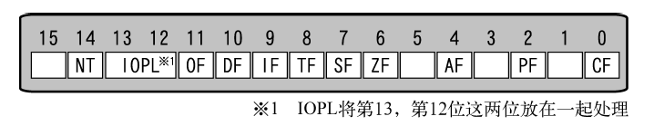

## Day 03 ~ Day 05

### Day 03

#### 前期记录与操作

由于之前没记清楚各种缩写, 导致看代码的时候出现了点困难, 现在先记录一下容易忘记的东西.

-IPL: initial program loader 启动程序加载器

| pseudo-instructions | function               |
| ------------------- | ---------------------- |
| JC                  | jump if carry          |
| JNC                 | jump if not carry      |
| JE                  | jump if equal          |
| JAE                 | jump if above or equal |
| INT                 | interrupt              |

由于省略的情况下, DS会作为段寄存器, 例如`MOV CX,[1234]`，其实是`MOV CX,[DS:1234]`, 故必须预先指定其为0, 否则地址的值要加上这个数的16倍(寻址空间为1M). 

| 16-bit segment register | function      |
| ----------------------- | ------------- |
| ES                      | extra segment |
| CS                      | code segment  |
| SS                      | stack segment |
| DS                      | data segment  |

作者给出的IPL启动区(512字节)在C0H0S1(柱面0, 磁头0, 扇区1), 接下来要装载的是C0H0S2.

#### 导入c语言

由于c语言中没有HLT而作者又特别喜欢使用, 那么只能用汇编语言写一个, 按照作者的思路, 我们得先实现一个`naskfunc.nas`

```asm
; naskfunc
; TAB = 4
[FORMAT "WCOFF"]    ;制作目标文件的模式
[BITS 32]           ;制作32位机用的机器语言

[FILE "naskfunc.nas"]

    GLOBAL  _io_hlt  ;程序中包含的函数名


[SECTION .text]      ;目标文件先写这些再写程序

_io_hlt:             ; void _io_hlt(void);
    _io_hlt
    RET
```

汇编编写后的函数需要与bootpack.obj链接, 所以也需要编译成目标文件。因此将输出格式设定为WCOFF模式(google后仍不知道什么意思)。

需要链接的函数名，都要用GLOBAL指令声明, 且函数名前需要有‘_’.

#### batch 语法

可以看到在make.bat中的make.exe后有`%1 %2 …. %9`这些都是用来在调用make.bat并加上参数时, 传给make.exe的参数.

`del` `copy`均为batch命令, 顾名思义, 不多解释.

#### gcc 语法

- `-wall` : 显示警告
- `-Os`: 相当于`-O2.5`, 使用了所有O2的优化而不减少代码尺寸

### Day 4

#### 内存写入

为了在c语言添加可以写入内存地址的函数, 我们需要在nask

func.nas 中添加一个`_write_mem8`, 并将函数设为gloabal

```asm
_write_mem8: ;void _write_mem8(int addr, int data);
		MOV		ECX, [ESP+4]
		MOV		AL, [ESP+8]
		MOV		[ECX], AL
		RET
```

注意: 

1. 函数中的第一个参数地址为[ESP+4], 第二个为[ESP+8], 第三个为[ESP +12]…
2. 由于我们的系统已经是32位, 所以不要使用16位的寄存器
3. 能自由使用的寄存器只有EAX, ECX和EDX, 由于c语言会用到其他寄存器, 故其他的只能读不能写.
4. naskfunc.nas 中还添加了一个 INSTRSET 指令, 告诉nasm本程序是给486cpu使用.


#### 条纹图案

真够亮的


### 指针

C语言中, 类型与保留字有以下的匹配:

- char : BYTE类
- short : WORD类
- int : DWORD类

可以通过char指针来直接给8位地址赋值

#### 色号设定

1. 定义`init_palette`函数, 用于初始化调色板

   1. 按照rgb的值写入一个**unsigned char**数组中, 防止0xff被误认为是-1的补码

2. 在汇编中加入用于io的函数

   - io_load_eflags: 记录中断许可标志的值
   - io_cli: 置中断许可标志为0, 禁止中断
   - io_store_eflags(eflags): 复原中断许可标志

   其中伪指令CLI是clear interrupt flag, 即interrupt flag 置0

   EFLAGS寄存器如图所示:

   

   汇编中需要说明两个函数:

   ```asm
   ;先将EFLAGS压入栈中, 然后pop出并送给EAX
   _io_load_eflags:	; int io_load_eflags(void);
   		PUSHFD 		; means PUSH EFLAGS
   		POP		EAX
   		RET
   
   ;先将 eflags 压入栈中, 然后再push给EFLAGS
   _io_store_eflags:	; void _io_store_eflags(int eflags)
   		MOV		EAX, [ESP+4]
   		PUSH 	EAX
   		POPFD
   		RET
   ```

   

   #### 绘制矩形和绘制界面

   

   这里只是简单的代码重复, 不再描述

   ### Day 5

   

   

   


### 参考:

- [gcc中o0, o1, o2, o3 优化的区别](https://blog.csdn.net/qq_31108501/article/details/51842166)