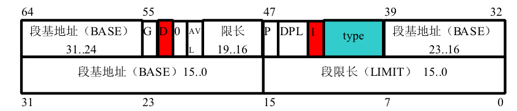

## Day 03 ~ Day 05

### Day 03

#### 前期记录与操作

由于之前没记清楚各种缩写, 导致看代码的时候出现了点困难, 现在先记录一下容易忘记的东西.

-IPL: initial program loader 启动程序加载器

| pseudo-instructions | function               |
| ------------------- | ---------------------- |
| JC                  | jump if carry          |
| JNC                 | jump if not carry      |
| JE                  | jump if equal          |
| JAE                 | jump if above or equal |
| INT                 | interrupt              |

由于省略的情况下, DS会作为段寄存器, 例如`MOV CX,[1234]`，其实是`MOV CX,[DS:1234]`, 故必须预先指定其为0, 否则地址的值要加上这个数的16倍(寻址空间为1M). 

| 16-bit segment register | function      |
| ----------------------- | ------------- |
| ES                      | extra segment |
| CS                      | code segment  |
| SS                      | stack segment |
| DS                      | data segment  |

作者给出的IPL启动区(512字节)在C0H0S1(柱面0, 磁头0, 扇区1), 接下来要装载的是C0H0S2.

#### 导入c语言

由于c语言中没有HLT而作者又特别喜欢使用, 那么只能用汇编语言写一个, 按照作者的思路, 我们得先实现一个`naskfunc.nas`

```asm
; naskfunc
; TAB = 4
[FORMAT "WCOFF"]    ;制作目标文件的模式
[BITS 32]           ;制作32位机用的机器语言

[FILE "naskfunc.nas"]

    GLOBAL  _io_hlt  ;程序中包含的函数名


[SECTION .text]      ;目标文件先写这些再写程序

_io_hlt:             ; void _io_hlt(void);
    _io_hlt
    RET
```

汇编编写后的函数需要与bootpack.obj链接, 所以也需要编译成目标文件。因此将输出格式设定为WCOFF模式(google后仍不知道什么意思)。

需要链接的函数名，都要用GLOBAL指令声明, 且函数名前需要有‘_’.

#### batch 语法

可以看到在make.bat中的make.exe后有`%1 %2 …. %9`这些都是用来在调用make.bat并加上参数时, 传给make.exe的参数.

`del` `copy`均为batch命令, 顾名思义, 不多解释.

#### gcc 语法

- `-wall` : 显示警告
- `-Os`: 相当于`-O2.5`, 使用了所有O2的优化而不减少代码尺寸

### Day 4

#### 内存写入

为了在c语言添加可以写入内存地址的函数, 我们需要在nask

func.nas 中添加一个`_write_mem8`, 并将函数设为gloabal

```asm
_write_mem8: ;void _write_mem8(int addr, int data);
		MOV		ECX, [ESP+4]
		MOV		AL, [ESP+8]
		MOV		[ECX], AL
		RET
```

注意: 

1. 函数中的第一个参数地址为[ESP+4], 第二个为[ESP+8], 第三个为[ESP +12]…
2. 由于我们的系统已经是32位, 所以不要使用16位的寄存器
3. 能自由使用的寄存器只有EAX, ECX和EDX, 由于c语言会用到其他寄存器, 故其他的只能读不能写.
4. naskfunc.nas 中还添加了一个 INSTRSET 指令, 告诉nasm本程序是给486cpu使用.


#### 条纹图案

真够亮的


### 指针

C语言中, 类型与保留字有以下的匹配:

- char : BYTE类
- short : WORD类
- int : DWORD类

可以通过char指针来直接给8位地址赋值

#### 色号设定

1. 定义`init_palette`函数, 用于初始化调色板

   1. 按照rgb的值写入一个**unsigned char**数组中, 防止0xff被误认为是-1的补码

2. 在汇编中加入用于io的函数

   - io_load_eflags: 记录中断许可标志的值
   - io_cli: 置中断许可标志为0, 禁止中断
   - io_store_eflags(eflags): 复原中断许可标志

   其中伪指令CLI是clear interrupt flag, 即interrupt flag 置0

   EFLAGS寄存器如图所示:

   

   汇编中需要说明两个函数:

   ```asm
   ;先将EFLAGS压入栈中, 然后pop出并送给EAX
   _io_load_eflags:	; int io_load_eflags(void);
   		PUSHFD 		; means PUSH EFLAGS
   		POP		EAX
   		RET
   
   ;先将 eflags 压入栈中, 然后再push给EFLAGS
   _io_store_eflags:	; void _io_store_eflags(int eflags)
   		MOV		EAX, [ESP+4]
   		PUSH 	EAX
   		POPFD
   		RET
   ```

   

   #### 绘制矩形和绘制界面

   

   这里只是简单的代码重复, 不再描述

## Day 5

#### 接受启动信息

在 bootpack.c里面的地址值和像素值应该从asmhead.nas里面获取, 我们可以构造一个结构体来保存这些数值, 书中写的很详细, 不多描述.

```c
// 0x0ff0是引导扇区地址
struct BOOTINFO *binfo = (struct BOOTINFO *)0x0ff0
```

##### BOOTINFO结构体的定义

在bootpack.c中, 作者定义了一个结构体:

```c
struct BOOTINFO {
char cyls, leds, vmode, reserve;
short scrnx, scrny;
char *vram;
};
```

它在asmhead.nas中的构成这样的:

```asm
#定义各结构地址
#symbol--EQU--expression_1: assign expression_1 to symbol
CYLS	EQU		0x0ff0			; 引导扇区设置
LEDS	EQU		0x0ff1
VMODE	EQU		0x0ff2			; 关于颜色的信息
SCRNX	EQU		0x0ff4			; 分辨率X
SCRNY	EQU		0x0ff6			; 分辨率Y
VRAM	EQU		0x0ff8			; 图像缓冲区的起始地址
#给各地址赋值
MOV		AL,0x13			; VGA显卡，320x200x8bit
MOV		AH,0x00
INT		0x10
MOV		BYTE [VMODE],8	; 屏幕的模式（参考C语言的引用）
MOV		WORD [SCRNX],320
MOV		WORD [SCRNY],200
MOV		DWORD [VRAM],0x000a0000
```

可以看到该结构的首地址是`0x0ff0`, 所以我们将地址0x0ff0赋值给结构体指针, 这样就可以通过内存地址顺序来获取到相应的信息了

#### 显示字符

函数如下, 得到所需字符指针font后, 将相应的像素变为目的颜色c. 

```c
void putfont8(char *vram, int xsize, int x, int y, char c, char *font)
{
int i;
char *p, d /* data */;
for (i = 0; i < 16; i++) {
p = vram + (y + i) * xsize + x;
d = font[i];
if ((d & 0x80) != 0) {
p[0] = c;
}
if ((d & 0x40) != 0) {
p[1] = c;
}
if ((d & 0x20) != 0) {
p[2] = c;
}
if ((d & 0x10) != 0) {
p[3] = c;
}
if ((d & 0x08) != 0) {
p[4] = c;
}
if ((d & 0x04) != 0) {
p[5] = c;
}
if ((d & 0x02) != 0) {
p[6] = c;
}
if ((d & 0x01) != 0) {
p[7] = c;
}
}
return;
}
```

#### 链接字符库

首先利用makefont工具将txt编译为bin文件, 再将bin转化为obj, 并得到一个名为‘hankaku'的量, 我们需要在makefile中做出如下改变

```makefile
#需要添加的
MAKEFONT = $(TOOLPATH)makefont.exe
BIN2OBJ  = $(TOOLPATH)bin2obj.exe

hankaku.bin : hankaku.txt Makefile
$(MAKEFONT) harkaku.txt hankaku.bin

hankaku.obj : hankaku.bin Makefile
$(BIN2OBJ) hankaku.bin hankaku.obj _hankaku

#需要变动的
--
bootpack.bim : bootpack.obj naskfunc.obj Makefile
$(OBJ2BIM) @$(RULEFILE) out:bootpack.bim stack:3136k map:bootpack.map bootpack.obj naskfunc.obj

++
bootpack.bim : bootpack.obj naskfunc.obj hankaku.obj Makefile
$(OBJ2BIM) @$(RULEFILE) out:bootpack.bim stack:3136k map:bootpack.map bootpack.obj naskfunc.obj hankaku.obj
```


#### 显示字符串

在得到hankaku数组后, 利用putfont函数实现输出字符串

```c
void putfonts8_asc(char *vram, int xsize, int x, int y, char c,
unsigned char *s)
{
extern char hankaku[4096];
for (; *s != 0x00; s++) {
putfont8(vram, xsize, x, y, c, hankaku + *s * 16);
x += 8;
}
return;
}
```

#### 显示鼠标指针

1. 添加以下函数

```c
//bc: background color
void init_mouse_cursor8(char *mouse, char bc);

//output the 8x8 block 
// vram == 0xa0000
// vxsize == 320 整个显示屏的宽度
// pxsize : 需要输出的x大小
// pysize: 需要输出的y大小
// px0: 输出位置
// py0: 输出位置
// buf: 鼠标地址
// bxsize: 鼠标大小
void putblock8_8(char *vram, int vcsize, int pxsize, int pysize, int px0,
int py0, char *buf, int bxsize);
```

2. 在main中加上

```c
init_mouse_cursor8(mcursor, COL8_008484);
putblock8_8(binfo->vram, binfo->scrnx, 16, 16, mx, my, mcursor, 16);
```

#### GDT与IDT的解释

##### 段寄存器(segment selector)(段选择子)

在32位系统中, 段寄存器仍然是一个16位的寄存器,  而在保护模式下, 段寄存器的第0位和第1位是RPL(request privilege level), 用来进行访问权限检查, 表示选择子的特权级; 第2位是TI(task indication), 0 表示使用GDT, 1表示使用LDT; 第3~15位是段描述符在相应描述表中的索引, 故我们只有2^13(8192)个位置以供索引使用.

###### 关于特权级的说明：

任务中的每一个段都有一个特定的级别。每当一个程序试图访问某一个段时，就将该程序所拥有的特权级与要访问的特权级进行比较，以决定能否访问该段。系统约定，CPU只能访问同一特权级或级别较低特权级的段。

##### GDT(global segment descriptor table)

在此时, 我们需要用用GDT来记录所有的段信息. 每个段信息为64bit, 即8Byte, 我.们有8192个段, 故我们需要在内存中分配64KB(8192x8Byte)来作为GDT.

在GDT中, 为了向下兼容, 段基地址分为三段.

GDT中每个段的信息如下:




1. G：

（1）、G=0时，段限长的20位为实际段限长，最大限长为2^20=1MB

（2）、G=1时，则实际段限长为20位段限长乘以2^12=4K，最大限长达到4GB

2. D/B：

当描述符指向的是可执行代码段时，这一位叫做D位，D=1使用32位地址和32/8位操作数，D=0使用16位地址和16/8位操作数。如果指向的是向下扩展的数据段，这一位叫做B位，B=1时段的上界为4GB，B=0时段的上界为64KB。如果指向的是堆栈段，这一位叫做B位，B=1使用32位操作数，堆栈指针用ESP，B=0时使用16位操作数，堆栈指针用SP。


3. DPL：特权级，0为最高特权级，3为最低，表示访问该段时CPU所需处于的最低特权级


4. type : 类型
（1）、type<8时：数据段


​	（2）、type>=8时：代码段


##### GDTR

GDTR一共有48位, 是用来存放GDT的内存起始地址和其表长界限. 

结构如下:


##### IDT(interrupt descriptor table) 

IDT记录了0~255号中断号码与调用函数的关系, 设定与GDT相似, 每个描述符也为64bit. 

| Name     | Bit    | Full Name                  | Description                                                  |
| -------- | ------ | -------------------------- | ------------------------------------------------------------ |
| Offset   | 48..63 | Offset 16..31              | Higher part of the offset.                                   |
| P        | 47     | Present                    | Set to **0** for unused interrupts.                          |
| DPL      | 45,46  | Descriptor Privilege Level | Gate call protection. Specifies which privilege Level the calling [Descriptor](https://wiki.osdev.org/Descriptor) minimum should have. So hardware and CPU interrupts can be protected from being called out of userspace. |
| S        | 44     | Storage Segment            | Set to **0** for interrupt and trap gates (see below).       |
| Type     | 40..43 | Gate Type 0..3             |                    |
| 0        | 32..39 | Unused 0..7                | Have to be **0**.                                            |
| Selector | 16..31 | Selector 0..15             | [Selector](https://wiki.osdev.org/Selector) of the interrupt function (to make sense - the kernel's selector). The selector's descriptor's DPL field has to be **0** so the **iret** instruction won't throw a #GP exeption when executed. |
| Offset   | 0..15  | Offset 0..15               | Lower part of the interrupt function's offset address (also known as pointer). |


#### GDT和IDT初始化

首先我们需要在汇编中加入

```asm
_load_gdtr: ;void _load_gdtr(int limit, int addr);
		MOV		AX,[ESP + 4]
		MOV		[ESP+6], AX
		LGDT 	[ESP+6]
		RET

_load_idtr: ;void _load_idtr(int limit, int addr)
		MOV		AX,[ESP+4]
		MOV		[ESP+6],AX
		LIDT 	[ESP+6] ;这里的+6是什么意思???
		RET
```


然后再在c中添加GD和ID, 并添加它们的设置函数

```c
void set_segmdesc(struct SEGMENT_DESCRIPTOR *sd, unsigned int limit, int base, int ar);
void set_gatedesc(struct GATE_DESCRIPTOR *gd, int offset, int selector, int ar);

// 段描述符 64bit
struct SEGMENT_DESCRIPTOR{
    //0\~15 16\~31
    short limit_low, base_low;
    // 32\~39 40\~47
    char base_mid, access_right;
    // 48\~55 56\~63
    char limit_high, base_high;
};

// IDT的64bit内容
struct GATE_DESCRIPTOR
{
    //offset 段内偏移地址, selector 选择子
    // 0~15 16~31
    short offset_low, selector;
    // 32~39 40~ 47
    char dw_count, access_right;
    // 48~63
    short offset_high;
};
```

在这里, GDT被初始化了在0x00270000-0x0027ffff中, 这只是因为这块内存没被利用, IDT也被初始化在未使用的0x26f800-0x26ffff中.

另外, 0x280000-0x2fffff已经被bootpack.h覆盖, 因为asmhead.nas帮我们作了处理.

由于我们需要分配4g内存, 而一共有8192个段, 故每个段需要分配2^19(512K)Byte的内存.

累坏了, 下周再看.

### 参考:

- [gcc中o0, o1, o2, o3 优化的区别](https://blog.csdn.net/qq_31108501/article/details/51842166)
- [构建GDT](https://zhuanlan.zhihu.com/p/25867829)
- [386与8086段寄存器的区别](https://blog.csdn.net/mark_chan/article/details/4751198)
- [GDT,LDT,GDTR,LDTR 详解,包你理解透彻](http://www.techbulo.com/708.html)
- [IDT](https://wiki.osdev.org/Interrupt_Descriptor_Table)