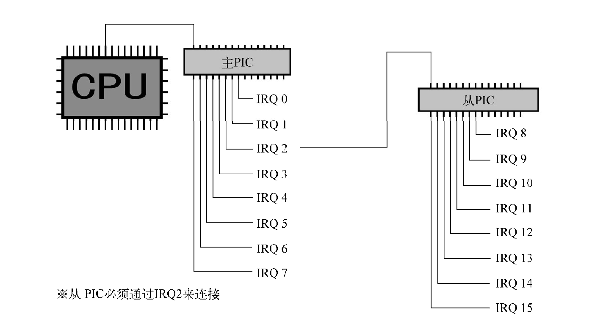

## Day 6 - 8

### Day 06: 分割编译与中断处理

#### 整理makefile

``` makefile
%.gas : %.c Makefile
	$(CC1) -o $*.gas $*.c

%.nas : %.gas Makefile
	$(GAS2NASK) $*.gas $*.nas

%.obj : %.nas Makefile
	$(NASK) $*.nas $*.obj $*.lst
```

使用预定义变量进行匹配 

其中makefile的预定义变量及其含义如下:

```makefile
$* 
不包含扩展名的目标文件名称。 

$+ 
所有的依赖文件，以空格分开，并以出现的先后为序，可能包含重复的依赖文件。 

$< 
第一个依赖文件的名称。 

$? 
所有的依赖文件，以空格分开，这些依赖文件的修改日期比目标的创建日期晚。 

$@ 
目标的完整名称。 

$^ 
所有的依赖文件，以空格分开，不包含重复的依赖文件。 

$% 
如果目标是归档成员，则该变量表示目标的归档成员名称。例如，如果目标名称为 
mytarget.so(image.o)，则 $@ 为 mytarget.so，而 $% 为 image.o。 
```

​	

#### load_gdtr 详解

``` asm
_load_gdtr: ; void load_gdtr(int limit, int addr);
MOV AX,[ESP+4] ; limit
MOV [ESP+6],AX
LGDT [ESP+6]
RET
```

由于我们的GDTR只有48位, 其中低16位为段上限, 高32位为基址, 而对于我们的第一个参数[ESP+4] 为段上限, 应该放在段上限, 

```asm
在传入的时候, 若limit为0x0000ffff, addr为0x00270000, 他们的存放如下
esp     esp+4       esp+8
| ffff0000 | 00002700 |
一个数的低位放在内存的低地址上

MOV		AX,[ESP+4]
| ffff0000 | -> AX

MOV		[ESP+6],AX
| ffff | 0000 | 0000 | 2700 | -> | ffff | ffff | 0000 | 2700 |

LGDT	[ESP+6]
| ffff | 0000 | 2700 | -> GDT
在GDTR中存放的数是0x00270000ffff, 可以看到总算跟标准的GDTR吻合了
```

#### 继续解释gdt

在GDT中, 段上限是4GB, 而limit只有20位,  这是因为在GDT中有一个标志位Gbit, 如果这个标志为1, 那么limit里面一个单位是1个page(4KB)


GDT的47~40, 55~52位是一共12位的段属性

由于55~40中还存有limit的高4位, 所以机器需要把属性作为16位来处理 : xxxx0000xxxxxxxx

##### 高4位

"ar的高4位被称为“扩展访问权”。为什么这么说呢？因为这高4位的访问属性在80286的时代
还不存在，到386以后才可以使用。这4位是由“GD00”构成的，其中G是指刚才所说的G bit，D
是指段的模式，1是指32位模式，0是指16位模式。这里出现的16位模式主要只用于运行80286的
程序，不能用于调用BIOS。所以，除了运行80286程序以外，通常都使用D=1的模式。"

##### 低8位

00000000（0x00）：未使用的记录表（descriptor table）。
10010010（0x92）：系统专用，可读写的段。不可执行。
10011010（0x9a）：系统专用，可执行的段。可读不可写。
11110010（0xf2）：应用程序用，可读写的段。不可执行。
11111010（0xfa）：应用程序用，可执行的段。可读不可写。

而我们在上次(day3-5)的文档已经解释过这八位的意义, 不再重复.

为了保护GDT, 当程序处于应用模式时不被允许修改GDT

CPU到底是处于系统模式还是应用模式，取决于执行中的应用程序是位于访问权为0x9a的
段，还是位于访问权为0xfa的段。

#### 初始化PIC (programmable interrupt controller) 



#### pic寄存器介绍

pic中的寄存器全是8位

- IMR(interrupt mask register) : 

  - 8位分别对应8路IRQ信号
  - 如果某一位为1, 那么该位对应的IRQ被屏蔽

- ICW(initial control word) :

  -  word的意思在不同机器上不一样, 可能为16bit 也可能为32bit 

  - ICW共有4个

    - ICW1和ICW4与主板配线和中断信号电器特性相关
    - ICW3: "是有关主从连接的设定, 对主PIC而言，第几号IRQ与从PIC相连，是用8位来设定的。
      如果把这些位全部设为1，那么主PIC就能驱动8个从PIC,但我们所用的电脑并不是这样的，所以就设定成00000100" , 而由于需要硬件与软件一致, ICW3也是不可以修改的.
    - ICW2: ICW2可以决定IRQ用哪一号中断通知cpu:
      - 当中断发生后, CPU命令pic发送两个字节(0xcd 0x??), 由于电路原因, 对于cpu来说从pic读入的2字节数据与从内存读入是一样的, 故cpu把送过来的数据以机器指令执行. 
        - 0xcd是INT
        - 0x??是int号

    这次是以INT 0x20\~0x2f接收中断信号IRQ0~15而设定的, 而0x00-0x0f 是用于cpu的保护系统通知, 两者不可重复.


#### 中断处理程序制作

鼠标是IRQ12，键盘是IRQ1，所以我们编写了用于INT 0x2c和INT 0x21的中断处理程序（handler）

##### 对PUSH和 POP的解释

`PUSH EAX` 相当于

```asm
ADD ESP,-4 ;esp减去4, 所得值作为地址, 将寄存器的值保存到这个地址对应的内存中
MOV [SS:ESP],EAX
```

而`POP EAX` 则相当于

```asm
MOV EAX,[SS:ESP] ; SS是栈段寄存器, 与ESP配合使用
ADD ESP,4
```

`PUSHAD`相当于

```asm
PUSH EAX
PUSH ECX
PUSH EDX
PUSH EBX
PUSH ESP
PUSH EBP
PUSH ESI
PUSH EDI
;按顺序执行这些操作
;而POPAD则刚好反过来, 从EDI开始一个个POP
```

##### 对于_asm_inthandler()的解释

``` asm
_asm_inthandler21: ; 在中断前保存寄存器状态, 并将ES和DS设为与SS值相同 并在中断后恢复寄存器
		PUSH	ES
		PUSH	DS
		PUSHAD
		MOV		EAX,ESP
		PUSH	EAX
		MOV		AX,SS
		MOV		DS,AX
		MOV		ES,AX
		CALL	_inthandler21
		POP		EAX
		POPAD
		POP		DS
		POP		ES
		IRETD
```

"关于在DS和ES中放入SS值的部分，因为C语言自以为是地认为“DS也好，ES也好，SS也好，它们都是指同一个段”，所以如果不按照它的想法设定的话，函数inthandler21就不能顺利执行"

#### 初始化IDT

```c
/* IDT的设定 */
set_gatedesc(idt + 0x21, (int) asm_inthandler21, 2 << 3, AR_INTGATE32);
set_gatedesc(idt + 0x2c, (int) asm_inthandler2c, 2 << 3, AR_INTGATE32);
```

这里的2 << 3 的2是指在第二段, 左移三位是因为最低三位有其他用途.

而这个号为2的段在前面的代码有说明: `set_segmdesc(gdt + 2, LIMIT_BOTPAK, ADR_BOTPAK, AR_CODE32_ER);`正好覆盖了整个bootpack.hrb

### Day 07

#### 获取键盘编码

修改int.c中的inthandler21

```c
io_out8(PIC0_OCW2, 0x61); /* 通知PIC"IRQ-01已经受理完毕" */
data = io_in8(PORT_KEYDAT);
sprintf(s, "%02X", data);
boxfill8(binfo->vram, binfo->scrnx, COL8_008484, 0, 16, 15, 31);
putfonts8_asc(binfo->vram, binfo->scrnx, 0, 16, COL8_FFFFFF, s);
```

将“0x60+IRQ号码”输出给OCW2即通知PIC中断已发生, 让PIC继续监视中断

#### 加快中断

```C
 if (keybuf.flag == 0) {
            io_stihlt();
        } else {
            i = keybuf.data;
            keybuf.flag = 0;
            io_sti();
 			// ...
 }
//在HariMain里使用io_stihlt()而不是先使用sti再使用hlt是因为
```

机器语言的STI指令之后，如果紧跟着HLT指令，那么就暂不受理这两条指令之间的中断，而要等到HLT指令之后才受理，所以使用io_stihlt函数就能克服这一问题

#### 制作FIFO缓冲区

