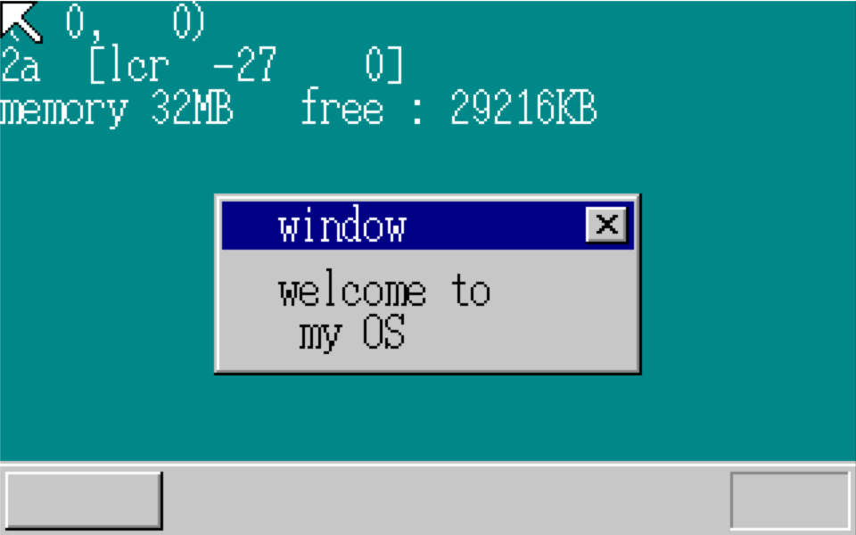

## day9~day11

### day 9

#### 内存管理

由于我们要查看内存容量, 而每次存入的时候都是先经过缓存, 所以我们需要先禁用缓存才能开始存数, 

```c
unsigned int memtest(unsigned int start, unsigned int end)
{
    char flg486 = 0;
    unsigned int eflg, cr0, i;
        /* 确认CPU是386还是486以上的 */
    eflg = io_load_eflags();
    eflg |= EFLAGS_AC_BIT; /* AC-bit = 1 */
    io_store_eflags(eflg);
    eflg = io_load_eflags();
    if ((eflg & EFLAGS_AC_BIT) != 0) { /* 如果是386，即使设定AC=1，AC的值还会自动回到0 */
    flg486 = 1;
    }
    eflg &= ~EFLAGS_AC_BIT; /* AC-bit = 0 */
    io_store_eflags(eflg);
    if (flg486 != 0) {
        cr0 = load_cr0();
        cr0 |= CR0_CACHE_DISABLE; /* 禁止缓存 */
        store_cr0(cr0);
    }
    i = memtest_sub(start, end);
    if (flg486 != 0) {
        cr0 = load_cr0();
        cr0 &= ~CR0_CACHE_DISABLE; /* 允许缓存 */
        store_cr0(cr0);
    }
    return i;
}
```

#### 内存检查

如果内存存在的话, 写入后再读出应该会和写入的内容一致. 所以, 我们可以通过写入一次, 读出一次, 如果内容相同再写入反转后的内容再读.  若两次都成功则说明此处内存存在. 最终找到无法写入的地方, 则找到了内存的尽头.

由于编译器会有优化, 所以我们只能通过写汇编来防止编译器优化掉原本的代码.

``` asm
_memtest_sub: ; (unsigned int start, unsigned int end)->unsigned int
		PUSH	EDI ; 需要使用这三个寄存器
		PUSH 	ESI
		PUSH 	EBX
		MOV		ESI, 0xAA55AA55 ; pat0 = 0xaa55aa55
		MOV 	EDI, 0x55AA55AA ; pat1 = 0x55aa55aa
		MOV 	EAX, [ESP+12+4] ; i = start
mts_loop:
		MOV 	EBX, EAX
		ADD 	EBX, 0xFFC		;p = i + 0xffc
		MOV		EDX, [EBX] 		;old = *p
		MOV 	[EBX], ESI 		;*p = pat0
		XOR 	DWORD [EBX], 0xFFFFFFFF ; *p^=0xffffffff
		CMP 	EDI, [EBX] 		; if(*p!=pat1) goto fin;
		JNE 	mts_fin
		XOR 	DWORD [EBX], 0xFFFFFFFF
		CMP 	ESI, [EBX] 		;if(*p != pat0) goto fin
		JNE 	mts_fin
		MOV 	[EBX], EDX 		;*p = old
		ADD 	EAX, 0x1000  	;i+=0x1000
		CMP 	EAX, [ESP+12+8]

		JBE 	mts_loop
		POP 	EBX
		POP 	ESI
		POP 	EDI
		RET
mts_fin:
		MOV 	[EBX], EDX 	 	;*p = old
		POP 	EBX
		POP 	ESI
		POP 	EDI
		RET
```

#### 内存分配与回收

此处逻辑比较简单, 通过创建一张可用表来实现内存管理. 

在分配内存时, 若某处可用且剩余空间大于所需空间, 则可以从该处获取内存, 若获取后该处剩余内存为0, 则删除此处节点, 并把其后节点向前移动一格.

回收内存时, 首先判断回收的起始地址是否为某个空余节点的终止地址, 若是则将两者连接; 再判断回收块的终止地址是否为下一节点的起始地址, 若是则将两者合并, 将下个节点之后的节点向前移动; 若都不是, 则首先将需要插入处后面的节点往后移动, 再将该回收块插入, 作为一个新节点, 更新表信息.

由于代码逻辑比较简单, 就不放了.

### day 10

#### 继续优化内存管理

为了防止碎片过多, 需要进行4k对齐

具体为`size = (size + 0xfff) & 0xfffff000`

#### 叠加图层

##### 图层构建

我们首先需要构建数层的结构体, 然后构建一个图层控制表, 其中一共有256个图层, 如图层级数大于-1则显示, 为-1则隐藏.

```c
#define MAX_SHEETS 256
struct SHEET{
    unsigned char *buf;
    int bxsize, bysize; // 图层整体大小
    int vx0, vy0; // 位置坐标
    int col_inv; //透明色色号
    int height; //图层高度
    int flags; //图层的设定信息
};

struct SHTCTL {
    unsigned char *vram;
    int xsize, ysize;                 // 画面大小
    int top;                          //最上层的高度
    struct SHEET *sheets[MAX_SHEETS]; // 按照升序排列存放图层
    struct SHEET sheets0[MAX_SHEETS]; //排序前的图层
};
```

##### 图层初始化、图层分配和图层设置

这三个没有什么难点， 直接阅读代码即可

```c
struct SHTCTL *shtctl_init(struct MEMMAN *memman, unsigned char *vram,
                           int xsize, int ysize)
{
    struct SHTCTL *ctl;
    int i;
    ctl = (struct SHTCTL *)memman_alloc_4k(memman, sizeof(struct SHTCTL));
    if (ctl == 0) {
        goto err;
    }
    ctl->vram = vram;
    ctl->xsize = xsize;
    ctl->ysize = ysize;
    ctl->top = -1;
    //初始化未使用图层
    for (i = 0; i < MAX_SHEETS; i++) {
        ctl->sheets0[i].flags = 0;
    }
err:
    return ctl;
}

struct SHEET *sheet_alloc(struct SHTCTL *ctl)
{
    struct SHEET *sht;
    int i;
    for (i = 0; i < MAX_SHEETS; i++) {
        if (ctl->sheets0[i].flags == 0) {
            sht = &ctl->sheets0[i];
            sht->flags = SHEET_USE; //标记 为正在使用,
            sht->height = -1;       //隐藏图层
            return sht;
        }
    }
    return 0; //表示所有图层都被使用了
}

void sheet_setbuf(struct SHEET *sht, unsigned char *buf, int xsize, int ysize,
                  int col_inv)
{
    sht->buf = buf;
    sht->bxsize = xsize;
    sht->bysize = ysize;
    sht->col_inv = col_inv;
    return;
}
```

##### 刷新图层

刷新时，我们要从下往上来进行涂色，

在这里的要点是只刷新变更前和变更后的区域, 要注意代码逻辑, 避免无用循环和判断过多

```c
void sheet_refreshsub(struct SHTCTL *ctl, int vx0, int vy0, int vx1, int vy1)
{
    //vx0,vy0是需要刷新区域的起始位置, vx1,vy1则是终止位置
    int h, bx, by, vx, vy, bx0, by0, bx1, by1;
    unsigned char *buf, c;
    unsigned char *vram = ctl->vram;
    struct SHEET *sht;
    for (h = 0; h <= ctl->top; h++) {
        sht = ctl->sheets[h];
        buf = sht->buf;
        //算出相对于需要刷新区域起始位置的坐标
        bx0 = vx0 - sht->vx0;
        by0 = vy0 - sht->vy0;
        bx1 = vx1 - sht->vx0;
        by1 = vy1 - sht->vy0;
        //超过需要刷新的区域则不刷新
        if (bx0 < 0)
            bx0 = 0;
        if (by0 < 0)
            by0 = 0;
        if (bx1 > sht->bxsize)
            bx1 = sht->bxsize;
        if (by1 > sht->bysize)
            by1 = sht->bysize;
        for (by = by0; by < by1; by++) {
            vy = sht->vy0 + by;
            for (bx = bx0; bx < bx1; bx++) {
                vx = sht->vx0 + bx;
                c = buf[by * sht->bxsize + bx];
                if (c != sht->col_inv) {
                    vram[vy * ctl->xsize + vx] = c;
                }
            }
        }
    }
    return;
}
```


##### 升降图层

每次修改图层级数的时候，需要判断是否从隐藏变为显示或者从显示变为隐藏，还需要判断是级数提升还是下降。

此处代码逻辑比较简单，但代码较长，就不放上来了

(今天就差不多完成了, 顺便吐槽下作者的主函数已经混乱不堪了)

### day11

#### 简化函数和增加窗口

​	

这部分也比较简单, 麻烦多在画图上, 不多解释

#### 增加计数器

```c
count++;
sprintf(s, "%010d", count);
boxfill8(buf_win, 160, COL8_C6C6C6, 40, 28, 119, 43);
putfonts8_asc(buf_win, 160, 40, 28, COL8_000000, s);
sheet_refresh(sht_win, 40, 28, 120, 44);
```

#### 消除闪烁

为了消除闪烁, 我们可以通过使用map来减少渲染次数.

map是一块与vram大小相同的内存, 里面记录的是当前像素所在的图层

首先我们需要为每个图层定义一个独特的sid, 使其在map中是唯一的, 我们可以将图层地址减去0号图层的地址作为sid, map的更新与之前的refreshsub函数一样.

接下来修改refreshsub: 我们只需要修改旧图层级数到新图层级数的部分即可.

需要注意的是, 当我们移动图层a时, 旧图层所在位置的map需要从0层开始更新, 而新图层只需要从图层a开始更新


(讨厌的图形化可算完成了

