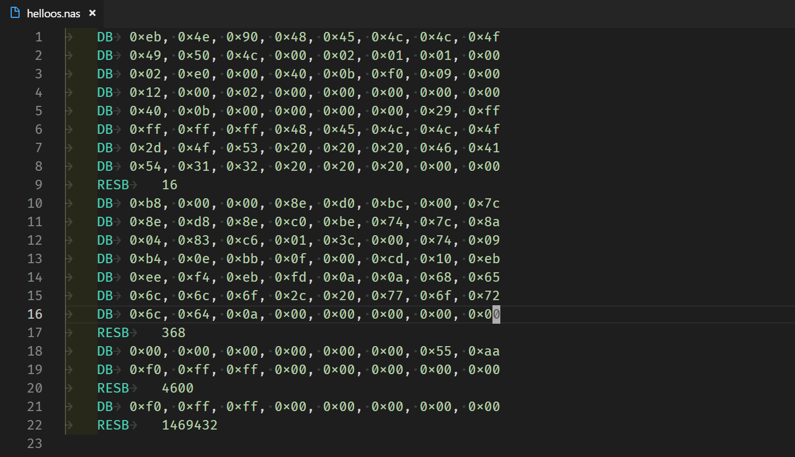
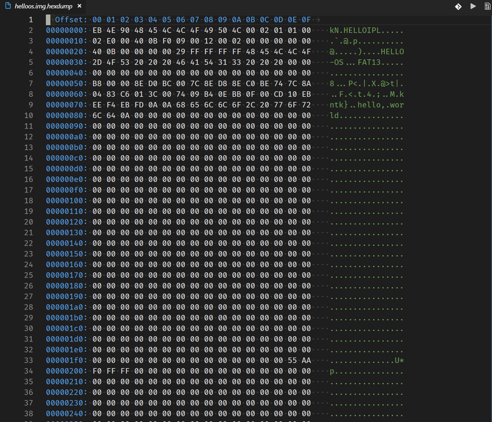
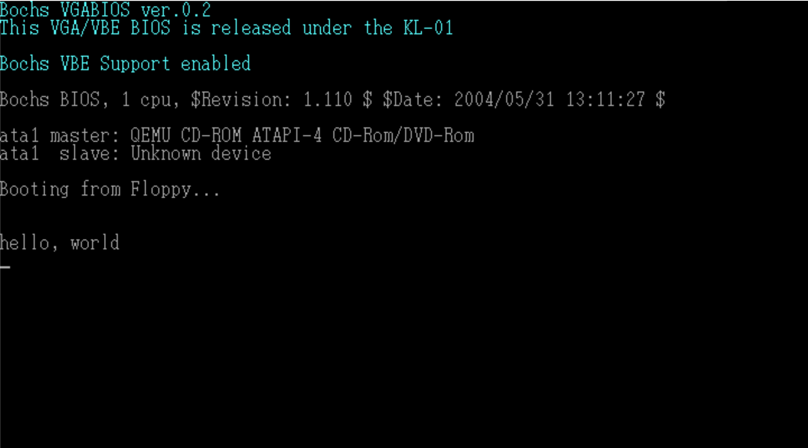

# Day 0~2

## Day 0

### 文件夹初始化

首先使用`git init`来初始化一个文件夹, 作为以后系统文件的版本和文档管理.

在文件夹中添加作者的`LICENSE.txt`和即将要写的`readme.md`

将作者的ToolSet放进文件夹根目录, 得到如图所示结构:


## Day 1

### 查看helloos.nas




### 查看NASM的文档

可以知道, 所有`RES?`为未初始化的名词, `D?`则是已经初始化的名词

| pseudo-instructions | function                                         |
| ------------------- | ------------------------------------------------ |
| db                  | define byte                                      |
| dw                  | define word. 2 bytes                             |
| dd                  | define double word. 4 bytes on x86 32-bit system |
| resb                | reseve byte                                      |

需要注意的地方:

| usage             | function                        |
| ----------------- | ------------------------------- |
| db 0x55,0x56,0x57 | three bytes in succession       |
| dw 0x1234         | 0x34 0x12                       |
| dw 'a'            | 0x61 0x00                       |
| dw 'ab'           | 0x61 0x62                       |
| dw 'abc'          | 0x61 0x62 0x63 0x00             |
| dd 0x12345678     | 0x78 0x56 0x34 0x12             |
| $                 | return the bytes to this symbol |
| ;                 | code comment                    |

### 检查 asm.bat 和 run.bat

由于在命令提示符中目录不区分'\'和'/', 故两种都可以使用.

```cmd
# asm.bat
..\z_tools\nask.exe ipl.nas ipl.bin ipl.ls

```

```cmd
#run.bat
copy helloos.img ..\z_tools\qemu\fdimage0.bin
..\z_tools\make.exe	-C ../z_tools/qemu
```


### 运行

使用 VSCode 查看编译好的二进制文件



运行结果如下



### 编写一个新程序

按照day1的section4来编写代码

```asm
; hello-os
; tab = 4

DB      0xeb, 0x4e, 0x90
DB      "HELLOIPL"          ;The booting section can be any string length of 8 byte.
DW      512                 ;Every sector MUST be 512 bytes in size.
DB      1                   ;Cluster MUST be 1 sector in size.
DW      1                   ;Starting position of FAT (It generally start from the 1st sector)
DB      2                   ;The number of FAT (MUST be 2)
DW      224                 ;The size of the root directory (generally 2)
DW      2880                ;The size of the disk (MUST be 2880 sectors)
DB      0xf0                ;The type of the disk (MUST be 0xf0)
DW      9                   ;The length of FAT (MUST be 9 sector)
DW      18                  ;The number of sector of a track (MUST be 18)
DW      2                   ;The number of magnetic head (MUST be 2)
DD      0                   ;NOT use partitions
DD      2880                ;the size when rewrite the disk
DB      0, 0, 0x29          ;meaningless
DD      0xffffffff          ;meaningless
DB      "HELLO-OS"          ;The name of disk (11 bytes)
DB      "FAT32"             ;The format of the disk (8 bytes)
RESB    18                  ;18 empty bytes

;the main body
DB        0xb8, 0x00, 0x00, 0x8e, 0xd0, 0xbc, 0x00, 0x7c
DB        0x8e, 0xd8, 0x8e, 0xc0, 0xbe, 0x74, 0x7c, 0x8a
DB        0x04, 0x83, 0xc6, 0x01, 0x3c, 0x00, 0x74, 0x09
DB        0xb4, 0x0e, 0xbb, 0x0f, 0x00, 0xcd, 0x10, 0xeb
DB        0xee, 0xf4, 0xeb, 0xfd

;display information
DB      0x0a, 0x0a               ;wrap twice
DB      "hello world"
DB      0x0a
DB      0

RESB 0x1fe-$                     ;write 0x00 until 0x001fe
DB 0x55, 0xaa

;output outside the booting section
DB      0xf0, 0xff, 0xff, 0x00, 0x00, 0x00, 0x00, 0x00
RESB    4600
DB      0xf0, 0xff, 0xff, 0x00, 0x00, 0x00, 0x00, 0x00
RESB    1469432
```

注意: 

1. 软盘每个扇区有512字节, 一张软盘共1440KB(2880个扇区)
2. 计算机首先从第一个扇区开始读软盘, 然后检查最后两个字节, 若最后两个字节不是0x55 AA, 那么计算机会认为盘上没有启动程序
3. IPL必须要补够8字节, 故使用"HELLOIPL"这个名字

## Day 2

### 汇编代码解释

对于16位机器的寄存器如下:

| 16-bit register | name                             |
| --------------- | -------------------------------- |
| AX              | accumulator                      |
| CX              | counter                          |
| DX              | data                             |
| BX              | base address                     |
| SP              | stack pointer                    |
| BP              | base address pointer             |
| SI              | source index 源变址寄存器        |
| DI              | destination index 目的变址寄存器 |

| 8-bit register | name             |
| -------------- | ---------------- |
| AL             | accumulator low  |
| CL             | counter low      |
| DL             | data low         |
| BL             | base low         |
| AH             | accumulator high |
| CH             | counter high     |
| DH             | data high        |
| BH             | base high        |

### 制作启动区

由于以后还需要进行其他开发, 故只用nasm做一个512KB的启动区, 其他部分用磁盘映像管理工具做.

``` cmd
# making.bat
..\z_tools\edimg.exe   imgin:../z_tools/fdimg0at.tek   wbinimg src:ipl.bin len:512 from:0 to:0   imgout:helloos.img
# 可以看到使用了edimg来截取ipl.bin, 最终得到一个512KB的文件
```

### Makefile 入门

首先编写一个Makefile文件, 但是由于windows10下没有make.exe, 只能改用mingw32-make.exe


```makefile
ipl.bin : ipl.nas Makefile
	../z_tools/nask.exe ipl.nas ipl.bin ipl.lst

helloos.img : ipl.bin Makefile
	../z_tools/edimg.exe   imgin:../z_tools/fdimg0at.tek \
		wbinimg src:ipl.bin len:512 from:0 to:0   imgout:helloos.img
```


#### Makefile 规则

```makefile
target ... : prerequisites ...
    command
# 其中target是目标文件
# prerequisites 是target的依赖
# command 是target 要执行的命令

```
