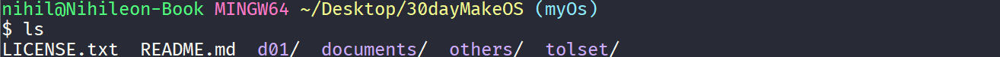

# Day 0~2

## Day 0

### 文件夹初始化

首先使用`git init`来初始化一个文件夹, 作为以后系统文件的版本和文档管理.

在文件夹中添加作者的`LICENSE.txt`和即将要写的`readme.md`

将作者的ToolSet放进文件夹根目录, 得到如图所示结构:

## Day 1

### 查看helloos.nas

### 查看NASM的文档

可以知道, 所有`RES?`为未初始化的名词, `D?`则是已经初始化的名词

| pseudo-instructions | function                                         |
| ------------------- | ------------------------------------------------ |
| db                  | define byte                                      |
| dw                  | define word. 2 bytes                             |
| dd                  | define double word. 4 bytes on x86 32-bit system |
| resb                | reseve byte                                      |

需要注意的地方:

| usage             | function                        |
| ----------------- | ------------------------------- |
| db 0x55,0x56,0x57 | three bytes in succession       |
| dw 0x1234         | 0x34 0x12                       |
| dw 'a'            | 0x61 0x00                       |
| dw 'ab'           | 0x61 0x62                       |
| dw 'abc'          | 0x61 0x62 0x63 0x00             |
| dd 0x12345678     | 0x78 0x56 0x34 0x12             |
|                   | return the bytes to this symbol |

### 运行

使用 VSCode 查看编译好的二进制文件

运行结果如下

### 编写一个新程序

