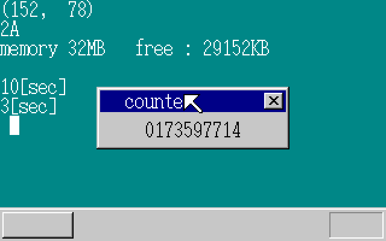
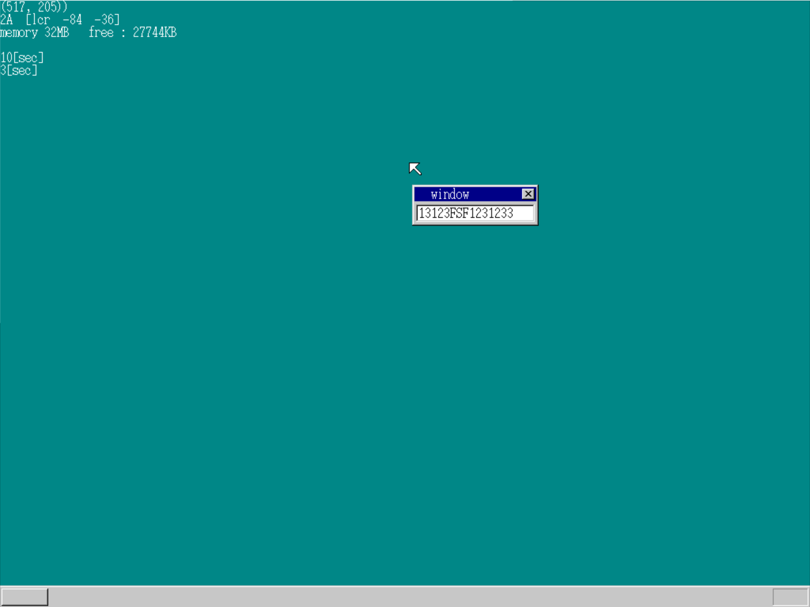

# day12~day14

## day12

### 使用定时器

由于每个计算机的时钟周期都不一样,  为了得到一个相同的时间间隔, 我们需要用到PIT.

我们可以通过设置PIT中断间隔来得到时间, 这个中断程序与键盘中断相似:

```c
#define PIT_CTRL	0x0043
#define PIT_CNT0	0x0040

	io_out8(PIT_CTRL, 0x34);
	io_out8(PIT_CNT0, 0x9c);//这两行是设置中断频率, 中断周期设为11932
	io_out8(PIT_CNT0, 0x2e);
```

```asm
_asm_inthandler20:
		PUSH	ES
		PUSH	DS
		PUSHAD
		MOV		EAX,ESP
		PUSH	EAX
		MOV		AX,SS
		MOV		DS,AX
		MOV		ES,AX
		CALL	_inthandler20
		POP		EAX
		POPAD
		POP		DS
		POP		ES
		IRETD
```

```c
void inthandler20(int *esp)
{
	int i, j;
	io_out8(PIC0_OCW2, 0x60); /* 通知PIC中断已被IRQ-00接受 */
	timerctl.count++;
	if (timerctl.next > timerctl.count) {
		return; /* 未到下一个时刻，结束*/
	}
	timerctl.next = 0xffffffff;
	for (i = 0; i < timerctl.using; i++) {
		/* timers的定时器都处于动作中，不确认flags */
		if (timerctl.timers[i]->timeout > timerctl.count) {
			break;
		}
		/* 超时*/
		timerctl.timers[i]->flags = TIMER_FLAGS_ALLOC;
		fifo8_put(timerctl.timers[i]->fifo, timerctl.timers[i]->data);
	}
	/* 有i个定时器超时了。其余的进行移位。 */
	timerctl.using -= i;
	for (j = 0; j < timerctl.using; j++) {
		timerctl.timers[j] = timerctl.timers[i + j];
	}
	if (timerctl.using > 0) {
		timerctl.next = timerctl.timers[0]->timeout;
	} else {
		timerctl.next = 0xffffffff;
	}
	return;
}
```

### 设置多个定时器

在设置定时器的时候, 我们首先用类似于设置图层的方法, 用一个数组存放未排序的定时器指针, 然后用另外一个数组存放已经排好序的定时器指针. 

在插入新定时器的时候, 找到超时位置, 将其后面的定时器往后移, 并且将其插入.

在发现超时的时候, 找到刚好不超时的那一个, 然后将它移动到0位置.

## day13

### 测试程序

今天都是一些测试环节, 由于我的电脑主频较高, 导致测试结果浮动过大, 无法得出像书本上的结果, 故略过.



### 调整fifo缓冲区

在这里, 由于不同定时器都在同一个地方输出状态, 故我们可以在获取状态的时候再进行判断, 可以接受一部分时间.

### 利用链表+哨兵加快中断

哨兵的意思是加一个超时时间为无限长的节点, 使得以下情况中的1、2两种无法进行, 节省判断时间.

1. 运行中的定时器只有一个
2. 插入到最后
3. 插入到两个之间
4. 插入到最前面

## day14

### 高分辨率设置

VBE的画面模式号码如下。
0x101……640× 480× 8bit 彩色
0x103……800× 600× 8bit 彩色
0x105……1024× 768× 8bit 彩色
0x107……1280× 1024× 8bit 彩色

```asm
MOV BX,0x4105 ; VBE的1024x768x8bit彩色
MOV AX,0x4f02
INT 0x10
MOV BYTE [VMODE],8 ; 画面模式
MOV WORD [SCRNX],1024
MOV WORD [SCRNY],768
MOV DWORD [VRAM],0xe0000000
```

### 键盘输入

在键盘按下后得到的数值加上0x80就是弹起时的数值

``` c
static char keytable[0x54] = {
0, 0, '1', '2', '3', '4', '5', '6', '7', '8', '9', '0', '-', '^', 0, 0,
'Q', 'W', 'E', 'R', 'T', 'Y', 'U', 'I', 'O', 'P', '@', '[', 0, 0, 'A', 'S',
'D', 'F', 'G', 'H', 'J', 'K', 'L', ';', ':', 0, 0, ']', 'Z', 'X', 'C', 'V',
'B', 'N', 'M', ',', '.', '/', 0, '*', 0, ' ', 0, 0, 0, 0, 0, 0,
0, 0, 0, 0, 0, 0, 0, '7', '8', '9', '-', '4', '5', '6', '+', '1',
'2', '3', '0', '.'
};
if (256 <= i && i <= 511) { /* 键盘数据 */
sprintf(s, "%02X", i - 256);
putfonts8_asc_sht(sht_back, 0, 16, COL8_FFFFFF, COL8_008484, s, 2);
    if (i < 256 + 0x54) {
        if (keytable[i - 256] != 0) {
        s[0] = keytable[i - 256];
        s[1] = 0;	
        putfonts8_asc_sht(sht_win, 40, 28, COL8_000000, COL8_C6C6C6, s, 1);
        }
    }
} else if (512 <= i && i <= 767) { /* 鼠标数据 */
```

### 追加和退格

这部分都比较简单, 就是每次循环时更新屏幕就行了

```c
if (i < 0x54 + 256) {
    if (keytable[i - 256] != 0 && cursor_x < 144) { /* 一般字符 */
    /* 显示1个字符就前移1次光标 */
        s[0] = keytable[i - 256];
        s[1] = 0;
        putfonts8_asc_sht(sht_win, cursor_x, 28, COL8_000000, COL8_FFFFFF, s, 1);
        cursor_x += 8;
    }
}
if (i == 256 + 0x0e && cursor_x > 8) { /* 退格键 */
/* 用空格键把光标消去后，后移1次光标 */
    putfonts8_asc_sht(sht_win, cursor_x, 28, COL8_000000, COL8_FFFFFF, " ", 1);
    cursor_x -= 8;
}
```

### 窗口移动

只有四行代码, 只要窗口图层跟着鼠标移动就行了

```c
if (mouse_decode(&mdec, i - 512) != 0) {
/* 收集了3字节的数据，显示出来 */
/* 光标移动 */
    sheet_slide(sht_mouse, mx, my);	
	if ((mdec.btn & 0x01) != 0) {
	/* 按下左键、移动sht_win */
		sheet_slide(sht_win, mx - 80, my - 8);
	}
}
```



