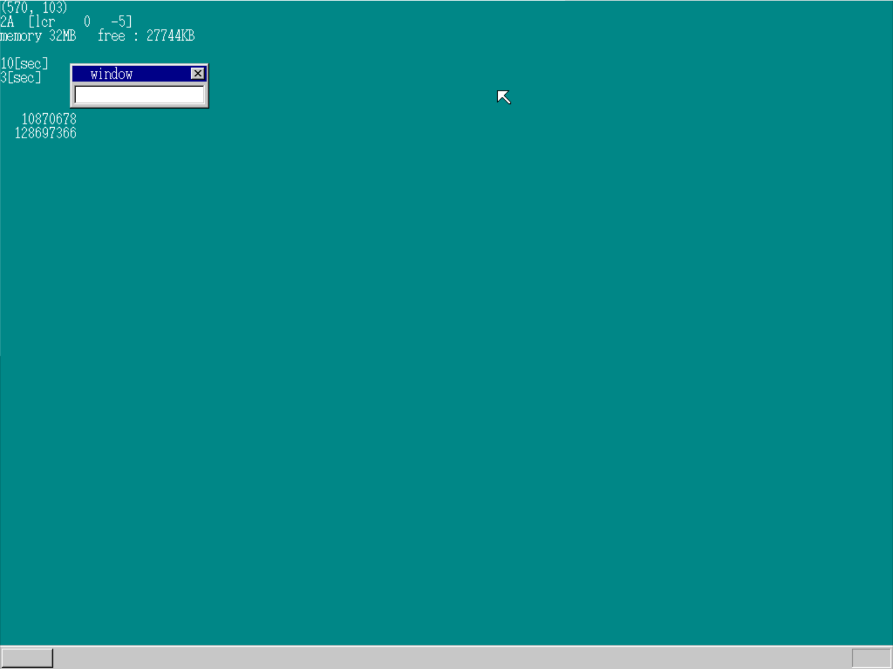
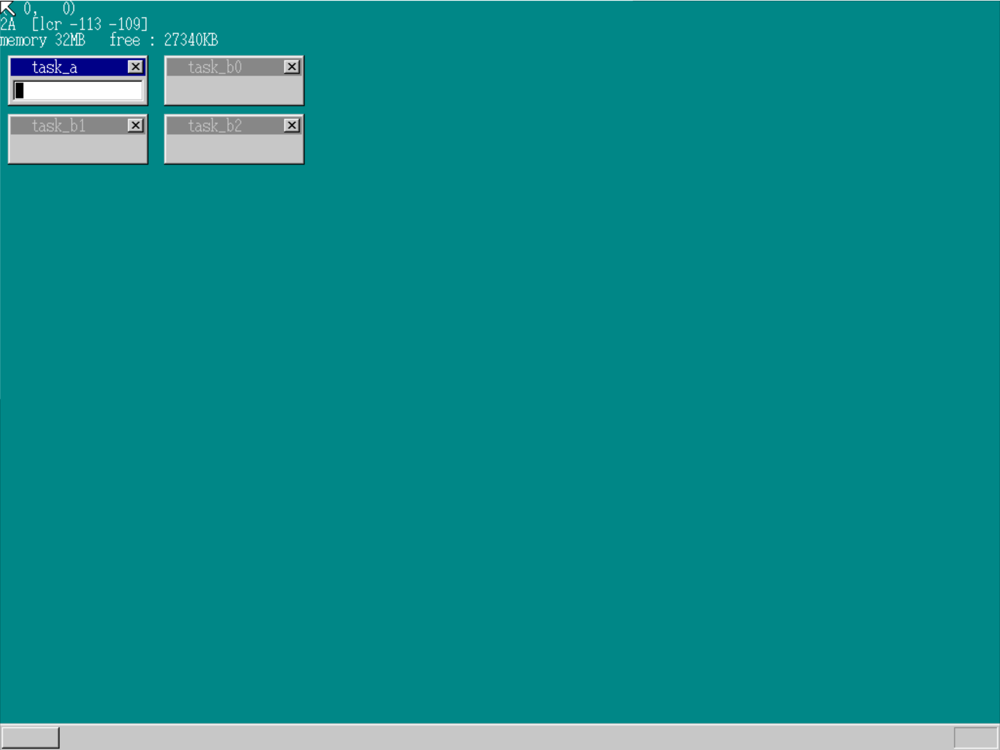

# day15-17

## day15

### 任务切换

#### 任务状态段TSS

它是一个内存段, 结构如下

```c
struct TSS32 {
	int backlink, esp0, ss0, esp1, ss1, esp2, ss2, cr3;
	int eip, eflags, eax, ecx, edx, ebx, esp, ebp, esi, edi;
	int es, cs, ss, ds, fs, gs;
	int ldtr, iomap;
};
```

TSS共计104字节, 其中

1. 第一行的成员保存的是与任务设置相关的数据; 
2. 第二行是32位寄存器; 
3. 第三行是16位寄存器 
4. 第四行是任务设置相关数据, 但必须要先初始化(ldtr置零, iomap置为0x40000000

- EIP 是 extended instruction pointer, 用于记录下一条执行指令位于内存中哪个地址的寄存器, 每执行一条指令eip会自动加一
- jmp指令相当于 MOV EIP, 0xaddress, 但无法使用mov对eip赋值

- jmp的far和near模式:
  - jmp DWORD 2*8:0x0000001b是far模式, 该指令在向eip存入0x1b时, 将cs(段寄存器) 置为16
  - 其他不带冒号的均为near

#### 任务寄存器TR

TR的作用是人cpu记住当前正在运行的任务

在使用TR时, 需要将GDT的号码乘以8

#### 切换任务

在切换前我们首先需要利用汇编写一个修改TR的函数和一个far jmp的函数

然后对两个tss段进行初始化, 

```c
	tss_a.ldtr = 0;
	tss_a.iomap = 0x40000000;
	tss_b.ldtr = 0;
	tss_b.iomap = 0x40000000;
	set_segmdesc(gdt + 3, 103, (int) &tss_a, AR_TSS32);
	set_segmdesc(gdt + 4, 103, (int) &tss_b, AR_TSS32);
	load_tr(3 * 8);
	task_b_esp = memman_alloc_4k(memman, 64 * 1024) + 64 * 1024;
	tss_b.eip = (int) &task_b_main;//将第二个函数的内存地址所在值赋给它
	tss_b.eflags = 0x00000202; /* IF = 1; */
	tss_b.eax = 0;
	tss_b.ecx = 0;
	tss_b.edx = 0;
	tss_b.ebx = 0;
	tss_b.esp = task_b_esp;
	tss_b.ebp = 0;
	tss_b.esi = 0;
	tss_b.edi = 0;
	tss_b.es = 1 * 8;
	tss_b.cs = 2 * 8; //段寄存器在2号GDT
	tss_b.ss = 1 * 8;
	tss_b.ds = 1 * 8;
	tss_b.fs = 1 * 8;
	tss_b.gs = 1 * 8;
```

初始化之后要给B任务分配一个内存栈, 防止其堆栈发生混乱

### 多任务

#### 简化far jump

利用汇编创建一个far jump函数, 便于进行跳转

#### 传递不变量

将不变量放入第二个任务的堆栈, 从第二个函数中读出即可

在这里要避免超出分配内存的范围(左闭右开)

#### 函数不能return

由于return 是用于返回调用该函数的被调用位置, 而多任务中的函数不是被调用的, 故不能进行return

#### 避免中断中进行任务切换

我们需要在等待中断完成之后才可以进行任务切换



## day16

### 任务管理自动化

首先创建一个struct TASKCTL, 

```c
struct TASK {
	int sel, flags; /*sel用于存放GDT编号 */
	struct TSS32 tss;
};
struct TASKCTL {
	int running; /* 正在运行的任务数 */
	int now; /* 记录当前运行的任务 */
	struct TASK *tasks[MAX_TASKS];
	struct TASK tasks0[MAX_TASKS];
}
```

TASKCTL类似于SHTCTL

#### 初始化任务

```c

struct TASK *task_init(struct MEMMAN *memman)
{
	int i;
	struct TASK *task;
	struct SEGMENT_DESCRIPTOR *gdt = (struct SEGMENT_DESCRIPTOR *) ADR_GDT;
	taskctl = (struct TASKCTL *) memman_alloc_4k(memman, sizeof (struct TASKCTL));
	for (i = 0; i < MAX_TASKS; i++) {
		taskctl->tasks0[i].flags = 0;
		taskctl->tasks0[i].sel = (TASK_GDT0 + i) * 8;
        //分配GDT编号
		set_segmdesc(gdt + TASK_GDT0 + i, 103, (int) &taskctl->tasks0[i].tss, AR_TSS32);
	}
	task = task_alloc();
	task->flags = 2; //活动中的标志
	taskctl->running = 1;
	taskctl->now = 0;
	taskctl->tasks[0] = task;
	load_tr(task->sel);
	task_timer = timer_alloc();
	timer_settime(task_timer, 2);
	return task;
}
```

返回一个地址的原因是, 调用init后所有程序的运行都会被当作任务来处理, 此时可以通过调用任务设置函数来对任务进行各种控制.

#### 获取task

此处是找到一个未使用的task, 然后返回它的地址, 不多描述

#### 任务切换

```c
void task_switch(void)
{
	timer_settime(task_timer, 2);
	if (taskctl->running >= 2) {
		taskctl->now++;
		if (taskctl->now == taskctl->running) {
			taskctl->now = 0;
		}
		farjmp(0, taskctl->tasks[taskctl->now]->sel);
	}
	return;
}
```

当任务数大于1的时候说明有多个任务, 需要进行切换

### 任务休眠

```c
void task_sleep(struct TASK *task)
{
	int i;
	char ts = 0;
	if (task->flags == 2) {		//如果该任务处于唤醒状态
		if (task == taskctl->tasks[taskctl->now]) {
			ts = 1; // 让自己休眠的话需要进行唤醒
		}
		//寻找task的位置
		for (i = 0; i < taskctl->running; i++) {
			if (taskctl->tasks[i] == task) {
				break;
			}
		}
		taskctl->running--;
		if (i < taskctl->now) {
			taskctl->now--; 
		}
		for (; i < taskctl->running; i++) {
			taskctl->tasks[i] = taskctl->tasks[i + 1];
		}
        
		task->flags = 1; //不工作的状态
		if (ts != 0) {
			//任务切换
			if (taskctl->now >= taskctl->running) {
				//如果now出现异常, 进行修正
				taskctl->now = 0;
			}
			farjmp(0, taskctl->tasks[taskctl->now]->sel);
		}
	}
	return;
}
```

#### 有数据输入时唤醒

```c
int fifo32_put(struct FIFO32 *fifo, int data)
//向fifo写入数据并累积
{
	if (fifo->free == 0) {
		fifo->flags |= FLAGS_OVERRUN;
		return -1;
	}
	fifo->buf[fifo->p] = data;
	fifo->p++;
	if (fifo->p == fifo->size) {
		fifo->p = 0;
	}
	fifo->free--;
	if (fifo->task != 0) {
		if (fifo->task->flags != 2) { //若为休眠状态则唤醒
			task_run(fifo->task); 
		}
	}
	return 0;
}
```

### 设定优先级

在设定优先级时, 我们需要考虑到优先级相同的情况, 如果出现两个相同优先级的任务, 我们需要让某个任务优先运行. 

当一个高优先级的任务插入时, 下次切换需要切到高优先级

当一个高优先级任务放到低优先级时, 下一次要检查是否要换级别切换



## day17

### 闲置任务

为了让系统在没有任务时停止, 我们要添加一个idle函数, 让系统能够自动停机

idle任务放在最底层, 这样可以很方便地进行切换

### 其他

图形界面部分由于与本门课重点无关, 故忽略