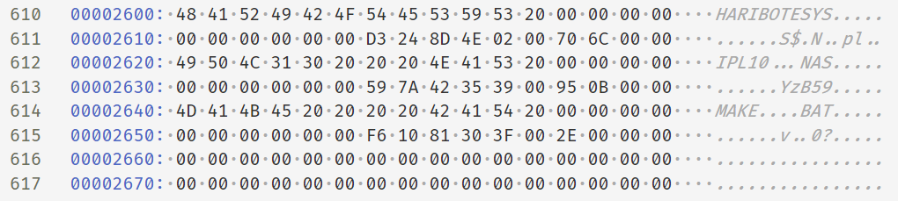
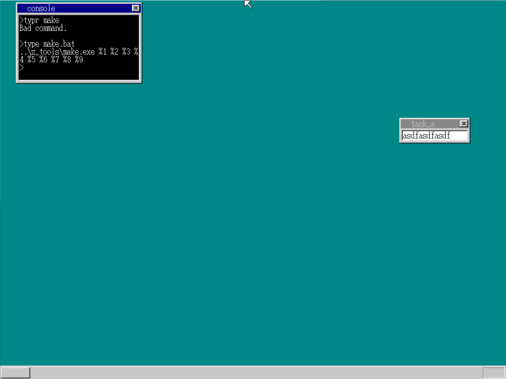
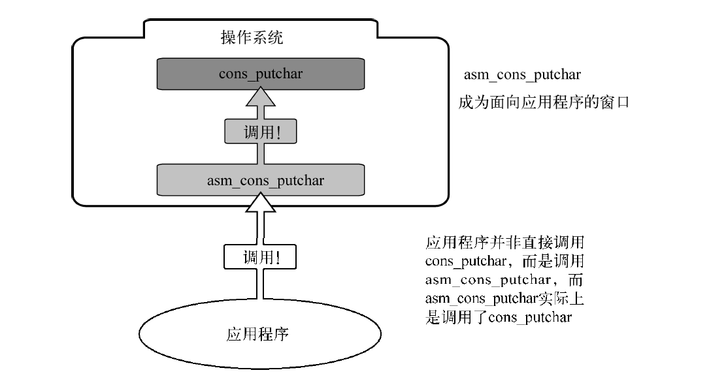
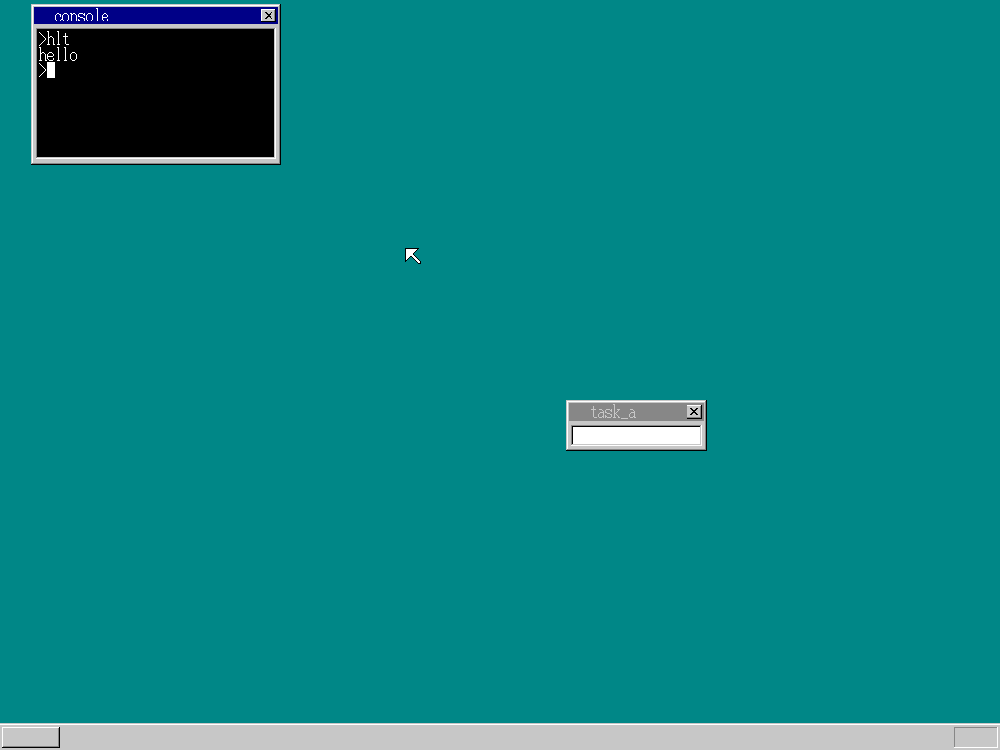

# day18-20

## day18

### mem命令

添加了memtotal和memman两个变量，它们是执行mem命令所必需的。关于memtotal，采用和sheet相同的方法从HariMain传递过来

### dir命令

在进入32位模式之前，我们已经从磁盘中读了10个柱面的内容, 这些数据放在0x00100000～0x00267fff中, 而文件名在0x002600 之后, 为了找到这些文件名, 我们需要修改makefile来进行查看

```makefile
haribote.img : ipl10.bin haribote.sys Makefile
$(EDIMG) imgin:../z_tools/fdimg0at.tek \
wbinimg src:ipl10.bin len:512 from:0 to:0 \
copy from:haribote.sys to:@: \
copy from:ipl10.nas to:@: \
copy from:make.bat to:@: \
imgout:haribote.img
```

make之后利用16位编辑器查看.img文件



内容是以32个字节为单位循环的，这32个字节的结构如下。

```c
struct FILEINFO {
	//开始的8个字节是文件名。文件名不足8个字节时，后面用空格补足。
    //接下来3个字节是扩展名，不足3个字节时用空格补足;果文件没有扩展名，则这3个字节都用空格补足
    //后面1个字节存放文件的属性信息
	unsigned char name[8], ext[3], type; 
    //10个字节为保留区, 暂无作用
	char reserve[10];
    //下面每2个字节为WORD整数，存放文件的时间, 日期和簇号(与扇区相似)
	unsigned short time, date, clustno;
    //DWORD 存放文件大小
	unsigned int size;
};
```

文件名超过8个字节的情况比较复杂, 暂不做考虑

如果文件名的第一个字节为0xe5，代表这个文件已经被删除了；文件名第一个字节为0x00，
代表这一段不包含任何文件名信息

属性信息:

- 0x01……只读文件（不可写入）
- 0x02……隐藏文件
- 0x04……系统文件
- 0x08……非文件信息（比如磁盘名称等）
- 0x10……目录

#### 在bootpack.h中加入结构体定义和添加结构体

```
#define ADR_DISKIMG		0x00100000
struct FILEINFO *finfo = (struct FILEINFO *) (ADR_DISKIMG + 0x002600); 
```


#### 在bootpack.c中加入dir命令

```c
for (x = 0; x < 224; x++) {
    if (finfo[x].name[0] == 0x00) {
        break;
    }
    if (finfo[x].name[0] != 0xe5) {
        if ((finfo[x].type & 0x18) == 0) {
            sprintf(s, "filename.ext   %7d", finfo[x].size);
            for (y = 0; y < 8; y++) {
                s[y] = finfo[x].name[y];
            }
            s[ 9] = finfo[x].ext[0];
            s[10] = finfo[x].ext[1];
            s[11] = finfo[x].ext[2];
            putfonts8_asc_sht(sheet, 8, cursor_y, COL8_FFFFFF, COL8_000000, s, 30);
            cursor_y = cons_newline(cursor_y, sheet);
        }
    }
}
```


## day19

### type 命令

根据作者对几个文件存放位置的查看和推测, 发现一个clustno就是一个512个字节, 即一个扇区

我们只需要将扇区内容按照顺序读入到屏幕即可, 其中需要注意的地方是, 文件名均为大写, 需要先将小写转换为大写

需要注意的是window的换行符与linux不一样, 需要进行两次判断, 忽略windows下的第二个换行字符



### 支持FAT

由于在windows下大于512字节的文件不一定在连续扇区中, 但是磁盘中又会有相应的记录, 所以我们只需要找到对应的记录就可以正确读取文件了.

已知clustno = 2，因此我们读取0x004200～0x0043ff这512个字节。接下来看FAT的第2号记录，其值为003，也就是说下面的部分存放在clustno = 3的位置，即读取0x004400～0x0045ff这512个字节。再接下来参照
FAT的第3号记录，即可得到下一个地址clustno = 4。以此类推，我们一直读取到clustno = 57（0x39）。57号扇区后面是FFF。这里就是文件的末尾。一般来说，如果遇到FF8～FFF的值，就代表文件数据到此结束

由于在接力模式下很容易损坏,  所以每个FAT文件都存了两份。第1份FAT位于0x000200～
0x0013ff，第2份位于0x001400～0x0025ff

```c
if (x < 224 && finfo[x].name[0] != 0x00) {
    p = (char *) memman_alloc_4k(memman, finfo[x].size);
    //0x003e00为第0簇位置
    file_loadfile(finfo[x].clustno, finfo[x].size, p, fat,
                  (char *) (ADR_DISKIMG + 0x003e00));
    cursor_x = 8;
    ...
```

由于压缩状态的FAT很难使用，因此我们先用file_readfat将其展开到fat[]。
然后，在type命令中，我们先分配一块和文件大小相同的内存空间，用file_loadfile将文件的内容读入内存。这样一来内存中的文件内容已经排列为正确的顺序，使用之前的程序来显示文件内容即可。显示完成后，释放用于临时存放文件内容的内存空间。

### 第一个程序

首先编写一个nas文件 命名为hlt.nas

```asm
[BITS 32]
	CLI
fin:
	HLT
	JMP fin
```

然后使用nask将其编译为hrb文件, hrb是作者自定义的一个后缀名.

我们首先用file_loadfile将其读入到内存中, 并且需要为其分配一个内存段, 段创建之后只需要goto到段所在的内存即可

读入内存后, 将其注册为GDT的1003号,  创建完成之后使用farjump跳转执行

## day20

### 显示单个字符的api

```asm
[BITS 32]
	MOV AL,'A'
	CALL （cons_putchar的地址）
fin:
	HLT
	JMP fin
```

这样做有个问题，因为cons_putchar是用C语言写的函数，即便我们将字符编码存入寄存器，函数也无法接收，因此我们必须在CALL之前将文字编码推入栈才行，但这样做也太麻烦了。

于是我们使用了汇编来编写一个函数来调用c语言中的函数, 而这个函数需要放在操作系统中



```asm
_asm_cons_putchar:
    PUSH 1
    AND EAX,0xff ; 将AH和EAX的高位置0，将EAX置为已存入字符编码的状态
    PUSH EAX
    PUSH DWORD [0x0fec] ; 读取内存并PUSH该值
    CALL _cons_putchar
    ADD ESP,12 ; 将栈中的数据丢弃
    RETF ;far-RET
```

在make之后我们可以在bootpack.map中找到一行

0x00000BE3 : _asm_cons_putchar

这就是_asm_cons_putchar的地址, 我们将其填入hlt.nas中

**注意: 一定要填上段的偏移号进行far-CALL, 而且需要使用far-RET**

```asm
[BITS 32]
    MOV AL,'A'
    CALL 2*8:0xbe3
fin:
    HLT
    JMP fin
```

由于c语言中没有far-call, 所以我们需要创建一个far-CALL函数

```asm
_farcall: ; void farcall(int eip, int cs);
    CALL FAR [ESP+4] ; eip, cs
    RET	
```

并对hlt.nas进行修改

```asm
[BITS 32]
    MOV AL,'A'
    CALL 2*8:0xbe8 ; 由于改写了代码,所以这个地方需要重新在bootpack.map中寻找
    RETF
```

### 不随地址变化的api

为了让api不随系统变化而改变, 我们将函数放在某个中断号中, 中断空余为0x30-0xff, 我们挑选一个0x40进行注册

```c
void init_gdtidt(void)
{
（中略）
/* IDT的设置*/
set_gatedesc(idt + 0x40, (int) asm_cons_putchar, 2 * 8, AR_INTGATE32); 
return;
}
```

这样, 我们每次中断就能调用__asm_cons_putchar

我们的hlt程序变为这样

```asm
[BITS 32]
    MOV AL,'h'
    INT 0x40
    MOV AL,'e'
    INT 0x40
    MOV AL,'l'
    INT 0x40
    MOV AL,'l'
    INT 0x40
    MOV AL,'o'
    INT 0x40
    RETF	
```

由于通过中断进入的程序无法返回, 所以我们还需要将函数末尾变为ITRETD

此外, 由于一旦进入中断程序, cpu会禁止中断, 所以我们需要将其恢复, 以防在api处理时无法输入

```asm
_asm_cons_putchar:
    STI ;恢复中断
    PUSH 1
    AND EAX,0xff ; 
    PUSH EAX
    PUSH DWORD [0x0fec] ;
    CALL _cons_putchar
    ADD ESP,12 ; 
    IRETD ; 中断返回指令
```



另外一个需要注意的地方是寄存器, 如果进入了中断之后, 寄存器的值很可能会改变, 所以我们最好对需要用到的寄存器在中断前压栈

```asm
_asm_cons_putchar:
    STI
    PUSHAD ; 这里！
    PUSH 1
    AND EAX,0xff ; 将AH和EAX的高位置0，将EAX置为已存入字符编码的状态
    PUSH EAX
    PUSH DWORD [0x0fec] ; 读取内存并PUSH该值
    CALL _cons_putchar
    ADD ESP,12 ; 将栈中的数据丢弃
    POPAD ; 这里！
    IRETD
```

### 设置功能号

由于IDT只有256个, 如果我们改用EDX来存放功能号则能有42亿个

我们可以如下划分

功能号1……显示单个字符（AL = 字符编码）
功能号2……显示字符串0（EBX = 字符串地址）
功能号3……显示字符串1（EBX = 字符串地址，ECX = 字符串长度）

接下来添加一个函数

```asm
_asm_hrb_api:
    STI
    PUSHAD ; 用于保存寄存器值的PUSH
    PUSHAD ; 用于向hrb_api传值的PUSH
    CALL _hrb_api
    ADD ESP,32
    POPAD
    IRETD	
```

改写init_gdtidt()

`set_gatedesc(idt + 0x40, (int) asm_hrb_api, 2 * 8, AR_INTGATE32);`

这样就可以很轻松地设置多个程序了