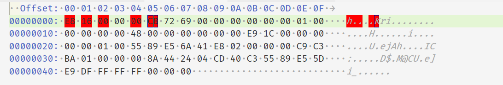
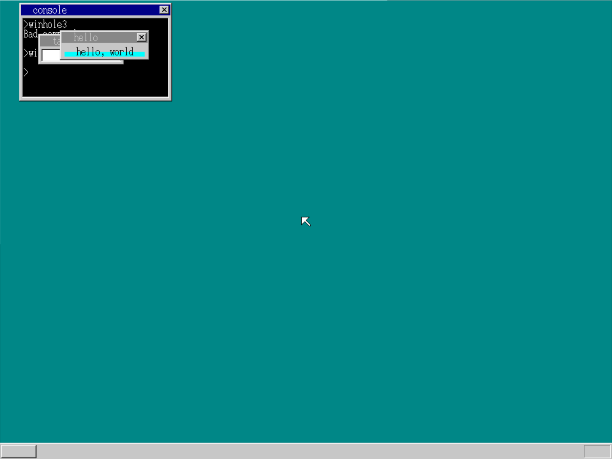

# DAY21-DAY23

## DAY21

### 字符串显示API:

显示单个字符时，我们用[CS:ECX]的方式特意指定了CS（代码段寄存器），因此可以成功读
取msg的内容。但在显示字符串时，由于无法指定段地址，程序误以为是DS而从完全错误的内存地址中读取了内容，碰巧读出的内容是0，于是就什么都没有显示出来hrb_api不知道代码段起始地址而cmd_app知道, 所以我们可以通过内存地址将段起始位置传给hrb_api, 我们可以使用0xfe8

### C语言编写应用程序

编写一个a.c

```c
void api_putchar(int c);
void HariMain(void)
{
    api_putchar('A');
    return;
}
```

写一个a_nask.nas

```asm
[FORMAT "WCOFF"]				
[INSTRSET "i486p"]				
[BITS 32]						
[FILE "a_nask.nas"]				
		GLOBAL	_api_putchar
[SECTION .text]

_api_putchar:	; void api_putchar(int c);
		MOV		EDX,1
		MOV		AL,[ESP+4]		; c
		INT		0x40
		RET

```

修改makefile

```makefile
a.bim : a.obj a_nask.obj Makefile
	$(OBJ2BIM) @$(RULEFILE) out:a.bim map:a.map a.obj a_nask.obj
a.hrb : a.bim Makefile
	$(BIM2HRB) a.bim a.hrb 0
```

由于缺少调用位置, 所以我们需要在二进制文件中加上



修改这6个字节就相当于

```asm
[BITS 32]
	CALL 0x1b
	RETF ;跳回到命令行
```

为了不用每次都修改二进制文件, 我们可以在console.c中修改, 在cmp_app中加上

```
if (finfo != 0) {
		
		p = (char *) memman_alloc_4k(memman, finfo->size);
		*((int *) 0xfe8) = (int) p;
		file_loadfile(finfo->clustno, finfo->size, p, fat, (char *) (ADR_DISKIMG + 0x003e00));
		set_segmdesc(gdt + 1003, finfo->size - 1, (int) p, AR_CODE32_ER);
		if (finfo->size >= 8 && strncmp(p + 4, "Hari", 4) == 0) {
			p[0] = 0xe8;
			p[1] = 0x16;
			p[2] = 0x00;
			p[3] = 0x00;
			p[4] = 0x00;
			p[5] = 0xcb;
		}
		farcall(0, 1003 * 8);
		memman_free_4k(memman, (int) p, finfo->size);
		cons_newline(cons);
		return 1;
	}
```

### 保护操作系统

#### 防止越界修改

为了防止程序访问和修改原本只属于操作系统的内存空间, 我们需要为应用程序提供专门的内存, 即创建专门的内存段

>操作系统用代码段……2 * 8
>操作系统用数据段……1 * 8
>应用程序用代码段……1003 * 8
>应用程序用数据段……1004 * 8
>（3 * 8～1002 * 8为TSS所使用的段）

在naskfunc.nas 中添加一个start_app函数

```asm
_start_app: ; void start_app(int eip, int cs, int esp, int ds);
    PUSHAD ; 将32位寄存器的值全部保存起来
    MOV EAX,[ESP+36] ; 给应用程序使用的EIP
    MOV ECX,[ESP+40] ; 应用程序的CS
    MOV EDX,[ESP+44] ; 应用程序的ESP
    MOV EBX,[ESP+48] ; 应用程序的DS/SS
    MOV [0xfe4],ESP ; 操作系统用ESP
    CLI ; 在切换过程中禁止中断请求
    MOV ES,BX
    MOV SS,BX
    MOV DS,BX
    MOV FS,BX
    MOV GS,BX
    MOV ESP,EDX
    STI ; 切换完成后恢复中断请求
    PUSH ECX ; 用于far-CALL的PUSH(cs)
    PUSH EAX ; 用于far-CALL的PUSH(eip)
    CALL FAR [ESP] ; 调用应用程序
    ; 应用程序结束后返回此处
    MOV EAX,1*8 ; 操作系统用DS/SS
    CLI ; 再次进行切换，禁止中断请求
    MOV ES,AX
    MOV SS,AX
    MOV DS,AX
    MOV FS,AX
    MOV GS,AX
    MOV ESP,[0xfe4]
    STI ; 切换完成后恢复中断请求
    POPAD ; 恢复之前保存的寄存器值
    RET
```

当使用API时应用程序需要调用hrb_api，但hrb_api是用C语言编写，因此如果不将段地址设回操作系统用的段就无法正常工作。需要修改_asm_hrb_api

```asm
_asm_hrb_api:
    ; 为方便起见从开头就禁止中断请求
    PUSH DS
    PUSH ES
    PUSHAD ; 用于保存的PUSH
    MOV EAX,1*8
    MOV DS,AX ; 先仅将DS设定为操作系统用
    MOV ECX,[0xfe4] ; 操作系统的ESP
    ADD ECX,-40
    MOV [ECX+32],ESP ; 保存应用程序的ESP
    MOV [ECX+36],SS ; 保存应用程序的SS
    ; 将PUSHAD后的值复制到系统栈
    MOV EDX,[ESP ]
    MOV EBX,[ESP+ 4]
    MOV [ECX ],EDX ; 复制传递给hrb_api
    MOV [ECX+ 4],EBX ; 复制传递给hrb_api
    MOV EDX,[ESP+ 8]
    MOV EBX,[ESP+12]
    MOV [ECX+ 8],EDX ; 复制传递给hrb_api
    MOV [ECX+12],EBX ; 复制传递给hrb_api
    MOV EDX,[ESP+16]
    MOV EBX,[ESP+20]
    MOV [ECX+16],EDX ; 复制传递给hrb_api
    MOV [ECX+20],EBX ; 复制传递给hrb_api
    MOV EDX,[ESP+24]
    MOV EBX,[ESP+28]
    MOV [ECX+24],EDX ; 复制传递给hrb_api
    MOV [ECX+28],EBX ; 复制传递给hrb_api
    MOV ES,AX ; 将剩余的段寄存器也设为操作系统用
    MOV SS,AX
    MOV ESP,ECX
    STI ; 恢复中断请求
    CALL _hrb_api
    MOV ECX,[ESP+32] ; 取出应用程序的ESP
    MOV EAX,[ESP+36] ; 取出应用程序的SS
    CLI
    MOV SS,AX
    MOV ESP,ECX
    POPAD
    POP ES
    POP DS
    IRETD ; 这个命令会自动执行STI
```

由于在应用程序中也会出现中断请求, 所以我们需要对DS和SS进行切换

```asm
_asm_inthandler20:
    PUSH ES
    PUSH DS
    PUSHAD
    MOV AX,SS
    CMP AX,1*8
    JNE .from_app
    ; 当操作系统活动时产生中断的情况和之前差不多
    MOV EAX,ESP
    PUSH SS ; 保存中断时的SS
    PUSH EAX ; 保存中断时的ESP
    MOV AX,SS
    MOV DS,AX
    MOV ES,AX
    CALL _inthandler20
    ADD ESP,8
    POPAD
    POP DS
    POP ES
    IRETD
.from_app:
    ; 当应用程序活动时发生中断
    MOV EAX,1*8
    MOV DS,AX ; 先仅将DS设定为操作系统用
    MOV ECX,[0xfe4] ; 操作系统的ESP
    ADD ECX,-8
    MOV [ECX+4],SS ; 保存中断时的SS
    MOV [ECX ],ESP ; 保存中断时的ESP
    MOV SS,AX
    MOV ES,AX
    MOV ESP,ECX
    CALL _inthandler20
    POP ECX
    POP EAX
    MOV SS,AX ; 将SS设回应用程序用
    MOV ESP,ECX ; 将ESP设回应用程序用
    POPAD
    POP DS
    POP ES
    IRETD
```

#### 异常处理

当应用程序试图破坏操作系统，或者试图违背操作系统的设置时，就会自动产生0x0d中断

```asm
_asm_inthandler0d:
    STI
    PUSH ES
    PUSH DS
    PUSHAD
    MOV AX,SS
    CMP AX,1*8
    JNE .from_app
    ; 当操作系统活动时产生中断的情况和之前差不多
    MOV EAX,ESP
    PUSH SS ; 保存中断时的SS
    PUSH EAX ; 保存中断时的ESP
    MOV AX,SS
    MOV DS,AX
    MOV ES,AX
    CALL _inthandler0d
    ADD ESP,8
    POPAD
    POP DS
    POP ES
    ADD ESP,4 ; 在INT 0x0d中需要这句
    IRETD
.from_app:
; 当应用程序活动时产生中断
    CLI
    MOV EAX,1*8
    MOV DS,AX ; 先仅将DS设定为操作系统用
    MOV ECX,[0xfe4] ; 操作系统的ESP
    ADD ECX,-8
    MOV [ECX+4],SS ; 保存产生中断时的SS
    MOV [ECX ],ESP ; 保存产生中断时的ESP
    MOV SS,AX
    MOV ES,AX
    MOV ESP,ECX
    STI
    CALL _inthandler0d
    CLI
    CMP EAX,0
    JNE .kill
    POP ECX
    POP EAX
    MOV SS,AX ; 将SS恢复为应用程序用
    MOV ESP,ECX ; 将ESP恢复为应用程序用
    POPAD
    POP DS
    POP ES
    ADD ESP,4 ; INT 0x0d需要这句
    IRETD
.kill:
    ; 将应用程序强制结束
    MOV EAX,1*8 ; 操作系统用的DS/SS
    MOV ES,AX
    MOV SS,AX
    MOV DS,AX
    MOV FS,AX
    MOV GS,AX
    MOV ESP,[0xfe4] ; 强制返回到start_app时的ESP
    STI ; 切换完成后恢复中断请求
    POPAD ; 恢复事先保存的寄存器值
    RET
```

然后将0d号中断加入init_gdtidt()

`set_gatedesc(idt + 0x0d, (int) asm_inthandler0d, 2 * 8, AR_INTGATE32);`

最后在console.c中加入inithandler0d这样一个函数

```c
int inthandler0d(int *esp)
{
	struct CONSOLE *cons = (struct CONSOLE *) *((int *) 0x0fec);
    cons_putstr0(cons, "\nINT 0D :\n General Protected Exception.\n");
    return 1; /*强制结束程序*/
}
```


#### 防止应用程序使用非指定DS

破坏程序如下

``` asm
[INSTRSET "i486p"]
[BITS 32]
    MOV EAX,1*8 ; OS用的段号
    MOV DS,AX ; 将其存入DS
    MOV BYTE [0x102600],0
    RETF
```

此时我们需要将DPL设为11, 即最低特权级


这个可以通过在cmd_app中修改段设置得到

```c
set_segmdesc(gdt + 1003, finfo->size - 1, (int) p, AR_CODE32_ER + 0x60); 
set_segmdesc(gdt + 1004, 64 * 1024 - 1, (int) q, AR_DATA32_RW + 0x60);
```

在修改后, cs中段地址为应用程序用的段地址时, cpu会认为"当前正在运行应用程序" , 如果此时存入操作系统用的段地址就会产生异常

如果使用这次的方法，就必须在TSS中注册操作系统用的段地址和ESP，因此，我们在start_app中增加了用于传递注册地址的代码.

根据x86的规则，是不允许操作系统CALL应用程序, 而操作系统向应用程序用的段进行far-JMP”也是被禁止的。我们可以使用RETF。事先将地址PUSH到栈中，然后执行RETF，这样就可以成功启动应用程序了。

```asm
_start_app: ; void start_app(int eip, int cs, int esp, int ds, int *tss_esp0);
    PUSHAD ; 将32位寄存器的值全部保存下来
    MOV EAX,[ESP+36] ; 应用程序用EIP
    MOV ECX,[ESP+40] ; 应用程序用CS
    MOV EDX,[ESP+44] ; 应用程序用ESP
    MOV EBX,[ESP+48] ; 应用程序用DS/SS
    MOV EBP,[ESP+52] ; tss.esp0的地址
    MOV [EBP ],ESP ; 保存操作系统用ESP
    MOV [EBP+4],SS ; 保存操作系统用SS
    MOV ES,BX
    MOV DS,BX
    MOV FS,BX
    MOV GS,BX
    ; 下面调整栈，以免用RETF跳转到应用程序
    OR ECX,3 ; 将应用程序用段号和3进行OR运算 作者没说明原理
    OR EBX,3 ; 将应用程序用段号和3进行OR运算
    PUSH EBX ; 应用程序的SS
    PUSH EDX ; 应用程序的ESP
    PUSH ECX ; 应用程序的CS
    PUSH EAX ; 应用程序的EIP
    RETF
    ; 应用程序结束后不会回到这里
```

由于我们不是通过far-CALL调用应用程序, 所以应用程序无法使用RETF

```asm
_asm_hrb_api:
    STI
    PUSH DS
    PUSH ES
    PUSHAD ; 用于保存的PUSH
    PUSHAD ; 用于向hrb_api传值的PUSH
    MOV AX,SS
    MOV DS,AX ; 将操作系统用段地址存入DS和ES
    MOV ES,AX
    CALL _hrb_api
    CMP EAX,0 ; 当EAX不为0时程序结束
    JNE end_app
    ADD ESP,32
    POPAD
    POP ES
    POP DS
    IRETD
end_app:
    ; EAX为tss.esp0的地址
    MOV ESP,[EAX]
    POPAD
    RET ; 返回cmd_app
```

当hrb_api返回0时继续运行应用程序，当返回非0的值时则当作tss.esp0的地址来处理，强制结束应用程序

程序结束的api分配到edx=4, 并再次修改inthandler0d

```c
int *inthandler0d(int *esp)
{
    struct CONSOLE *cons = (struct CONSOLE *) *((int *) 0x0fec);
    struct TASK *task = task_now(); 
    cons_putstr0(cons, "\nINT 0D :\n General Protected Exception.\n");
    return &(task->tss.esp0); /*让程序强制结束*/ 
}
```

将除了\_asm_inthandler0d的所有中断处理改回原来版本, 然后\_asm_inthandler0d按下面的形式修改

```asm
_asm_inthandler0d:
    STI
    PUSH ES
    PUSH DS
    PUSHAD
    MOV EAX,ESP
    PUSH EAX
    MOV AX,SS
    MOV DS,AX
    MOV ES,AX
    CALL _inthandler0d
    CMP EAX,0 ; 只有这里不同
    JNE end_app ; 只有这里不同
    POP EAX
    POPAD
    POP DS
    POP ES
    ADD ESP,4 ; 在INT 0x0d中需要这句
    IRETD
```

还要修改一下IDT的设置。当应用程序试图调用未经操作系统授权的中断时，CPU会产生异常。因此，我们需要在IDT中将INT 0x40设置为“可供应用程序作为API来调用的中断”。

在init_gdtint中加入

`set_gatedesc(idt + 0x40, (int) asm_hrb_api, 2 * 8, AR_INTGATE32 + 0x60);`

对应用程序结束方式进行修改

例如hello.nas

```asm
[INSTRSET "i486p"]
[BITS 32]
    MOV ECX,msg
    MOV EDX,1
putloop:
    MOV AL,[CS:ECX]
    CMP AL,0
    JE fin
    INT 0x40
    ADD ECX,1
    JMP putloop
fin:
    MOV EDX,4 ; 这里！
    INT 0x40 ; 这里！
msg:
    DB "hello",0
```

又如a.c

```c
void api_putchar(int c);
void api_end(void); /*这里！*/
void HariMain(void)
{
    api_putchar('A');
    api_end(); /*这里！*/
}
```

a_nask.nas:

```asm
[FORMAT "WCOFF"]
[INSTRSET "i486p"]
[BITS 32]
[FILE "a_nask.nas"]
    GLOBAL _api_putchar
    GLOBAL _api_end ; 这里！
[SECTION .text]
_api_putchar: ; void api_putchar(int c);
    MOV EDX,1
    MOV AL,[ESP+4] ; c
    INT 0x40
    RET
_api_end: ; void api_end(void); ; 从此开始
    MOV EDX,4
    INT 0x40 ; 到此结束
```

## day22

### 帮助发现应用程序的bug

此处的例子越界访问数组

```c
void HariMain(void)
{
    char a[100];
    a[10] = 'A'; /*这句当然没有问题*/
    api_putchar(a[10]);
    a[102] = 'B'; /*这句就有问题了*/
    api_putchar(a[102]);
    a[123] = 'C'; /*这句也有问题了*/
    api_putchar(a[123]);
    api_end();
}
```

类似这样的越界会导致系统错误, 所以我们需要一个函数来处理栈异常, 我们放在0x0c中

\_asm_inthandler0c与\_asm_inthandler0d一样, 基本不需要进行修改, 而inthandler0c只是修改了inthandler0d的出错信息

在验证后我们发现在输出B时没有发生异常, 而输出C才被发现, 这是因为操作系统异常是为了保护系统本身而非发现BUG

不过我们也可以通过输出寄存器值来得到异常情况


```c
int *inthandler0c(int *esp)
{
    struct CONSOLE *cons = (struct CONSOLE *) *((int *) 0x0fec);
    struct TASK *task = task_now();
    char s[30]; /*这里！*/
    cons_putstr0(cons, "\nINT 0C :\n Stack Exception.\n");
    sprintf(s, "EIP = %08X\n", esp[11]); /*这里！*/
    cons_putstr0(cons, s); /*这里！*/
    return &(task->tss.esp0); /*强制结束程序*/
}
```

>esp[ 0] : EDI
>esp[ 1] : ESI esp[0～7]为_asm_inthandler中PUSHAD的结果
>esp[ 2] : EBP
>esp[ 4] : EBX
>esp[ 5] : EDX
>esp[ 6] : ECX
>esp[ 7] : EAX
>esp[ 8] : DS esp[8～9]为_asm_inthandler中PUSH的结果
>esp[ 9] : ES
>esp[10] : 错误编号（基本上是0，显示出来也没什么意思）
>esp[11] : EIP
>esp[12] : CS esp[10～15]为异常产生时CPU自动PUSH的结果
>esp[13] : EFLAGS
>esp[14] : ESP （应用程序用ESP）
>esp[15] : SS （应用程序用SS）

### 强制结束程序

```c
void HariMain(void)
{
    for (;;) { }
}
```

修改HariMain

```c
if (i == 256 + 0x3b && key_shift != 0 && task_cons->tss.ss0 != 0) { /* Shift+F1 */
    cons = (struct CONSOLE *) *((int *) 0x0fec);
    cons_putstr0(cons, "\nBreak(key):\n");
    io_cli(); /*不能在改变寄存器值时切换到其他任务*/
    task_cons->tss.eax = (int) &(task_cons->tss.esp0);
    task_cons->tss.eip = (int) asm_end_app;
    io_sti();
}
```

这样一来程序会被强制结束，但也当应用程序没有在运行的时候，强制结束会发生误操作.我们必须要确认task_cons -> tss.ss0不为0时才能继续进行处理。

```asm
_asm_end_app:
    ; EAX为tss.esp0的地址
    MOV ESP,[EAX]
    MOV DWORD [EAX+4],0 ; 这里！
    POPAD
    RET ; 返回cmd_app
```

`````c
struct TASK *task_alloc(void)
{
	int i;
	struct TASK *task;
	for (i = 0; i < MAX_TASKS; i++) {
	if (taskctl->tasks0[i].flags == 0) {
        task = &taskctl->tasks0[i];
        task->flags = 1; /*正在使用的标志*/
        task->tss.eflags = 0x00000202; /* IF = 1; */
        task->tss.eax = 0; /*将其置为0*/
        （中略）
        task->tss.iomap = 0x40000000;
        task->tss.ss0 = 0; /*这里！*/
        return task;
        }
    }
	return 0; /*已经全部正在使用*/
}
`````

### 显示字符串

.hrb文件由数据和代码组成, hrb的数据部分会在程序启动时被传送到应用程序用的数据段中, 而hrb文件中数据部分的位置放在代码部分开头的一块区域中.

作者在文件开头的36个字节中存放了如下信息

>0x0000 (DWORD) ……请求操作系统为应用程序准备的数据段的大小
>0x0004 (DWORD) ……“Hari”（.hrb文件的标记）
>0x0008 (DWORD) ……数据段内预备空间的大小
>0x000c (DWORD) ……ESP初始值&数据部分传送目的地址
>0x0010 (DWORD) ……hrb文件内数据部分的大小
>0x0014 (DWORD) ……hrb文件内数据部分从哪里开始
>0x0018 (DWORD) ……0xe9000000 (jmp指令码)
>0x001c (DWORD) ……应用程序运行入口地址 - 0x20
>0x0020 (DWORD) ……malloc空间的起始地址

### 显示窗口API

>EDX = 5
>EBX = 窗口缓冲区
>ESI = 窗口在x轴方向上的大小（即窗口宽度）
>EDI = 窗口在y轴方向上的大小（即窗口高度）
>EAX = 透明色
>ECX = 窗口名称
>调用后，返回值如下：
>EAX =用于操作窗口的句柄（用于刷新窗口等操作）

在asm_hrb_api中我们执行了两次PUSHAD，第一次是为了保存寄存器的值，第
二次是为了向hrb_api传递值.

因此如果我们查出被传递的变量的地址，在那个地址的后面应该正好存放着相同的寄存器的值。


## day23

### 编写malloc

在程序中添加malloc函数可以在需要的时候才分配内存, 从而让程序变得短小精悍

如果api_malloc调用操作系统中的memman_alloc，获得的内存空间并不位于应用程序的数据段范围内，应用程序无法进行读写操作。如果应用程序在不知情的情况下执行了读写操作，将会产生异常并强制结束。

当指定了malloc所需内存大小时，这个数值会和栈等的大小进行累加，并写入.hrb文件最开头的4个字节中。因此，操作系统不需要做任何改动，就可以确保在应用程序段中分配到包括malloc所需部分在内的全部内存空间。

#### api设计

>memman初始化
>EDX=8
>EBX=memman的地址
>EAX=memman所管理的内存空间的起始地址
>ECX=memman所管理的内存空间的字节数
>
>malloc
>EDX=9
>EBX=memman的地址
>ECX=需要请求的字节数
>EAX=分配到的内存空间地址
>
>free
>EDX=10
>EBX=memman的地址
>EAX=需要释放的内存空间地址
>ECX=需要释放的字节数

根据api修改console.c

```c
int *hrb_api(int edi, int esi, int ebp, int esp, int ebx, int edx, int ecx, int eax)
{
    （中略）
    } else if (edx == 8) {
        memman_init((struct MEMMAN *) (ebx + ds_base));
        ecx &= 0xfffffff0; /*以16字节为单位*/
        memman_free((struct MEMMAN *) (ebx + ds_base), eax, ecx);
    } else if (edx == 9) {
        ecx = (ecx + 0x0f) & 0xfffffff0; /*以16字节为单位进位取整*/
        reg[7] = memman_alloc((struct MEMMAN *) (ebx + ds_base), ecx);
    } else if (edx == 10) {
        ecx = (ecx + 0x0f) & 0xfffffff0; /*以16字节为单位进位取整*/
        memman_free((struct MEMMAN *) (ebx + ds_base), eax, ecx);
    }
    return 0;
}
```

a_nask.nas

```asm
_api_initmalloc: ; void api_initmalloc(void);
    PUSH EBX
    MOV EDX,8
    MOV EBX,[CS:0x0020] ; malloc内存空间的地址
    MOV EAX,EBX
    ADD EAX,32*1024 ; 加上32KB
    MOV ECX,[CS:0x0000] ; 数据段的大小
    SUB ECX,EAX
    INT 0x40
    POP EBX
    RET
_api_malloc: ; char *api_malloc(int size);
    PUSH EBX
    MOV EDX,9
    MOV EBX,[CS:0x0020]
    MOV ECX,[ESP+8] ; size
    INT 0x40
    POP EBX
    RET
_api_free: ; void api_free(char *addr, int size);
    PUSH EBX
    MOV EDX,10
    MOV EBX,[CS:0x0020]
    MOV EAX,[ESP+ 8] ; addr
    MOV ECX,[ESP+12] ; size
    INT 0x40
    POP EBX
    RET
```



图形界面部分与操作系统关系不大, 故忽略