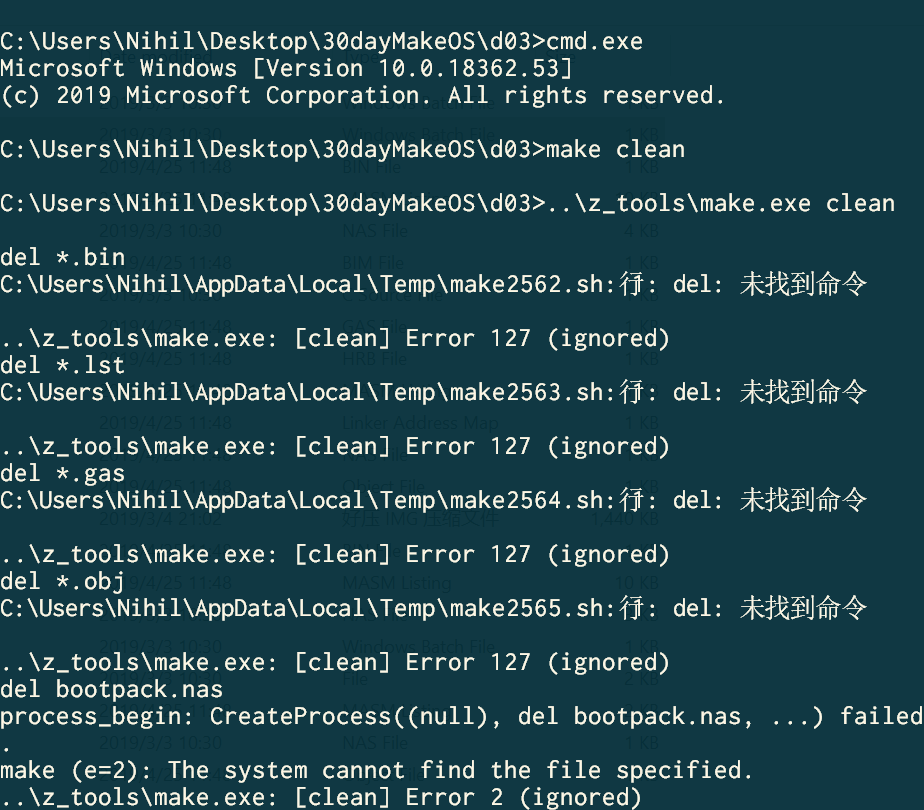
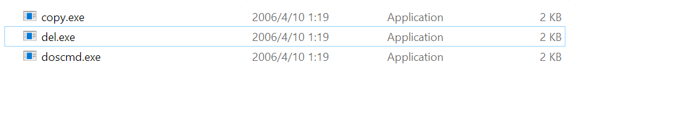
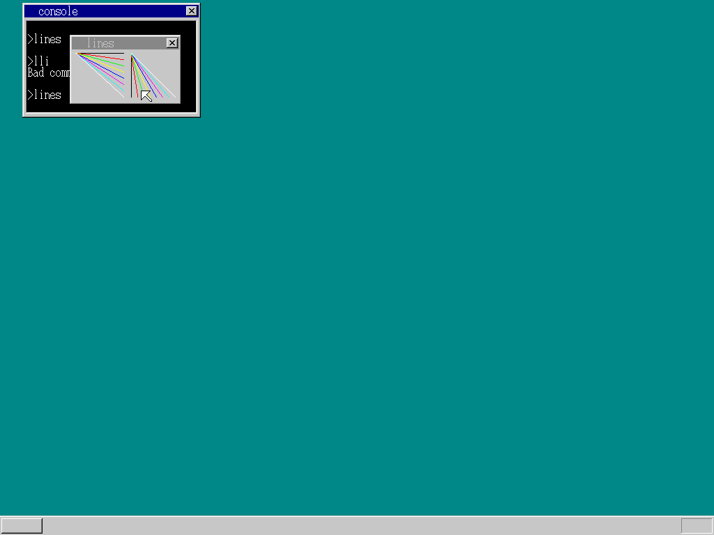
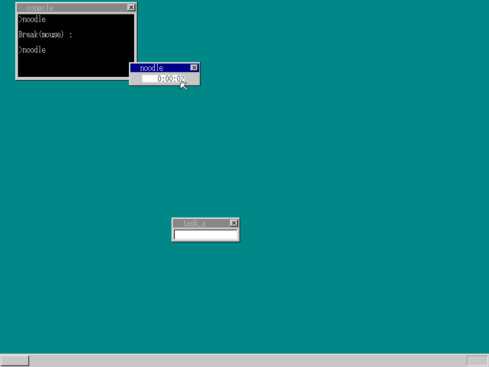
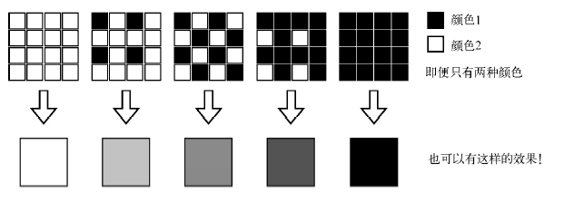
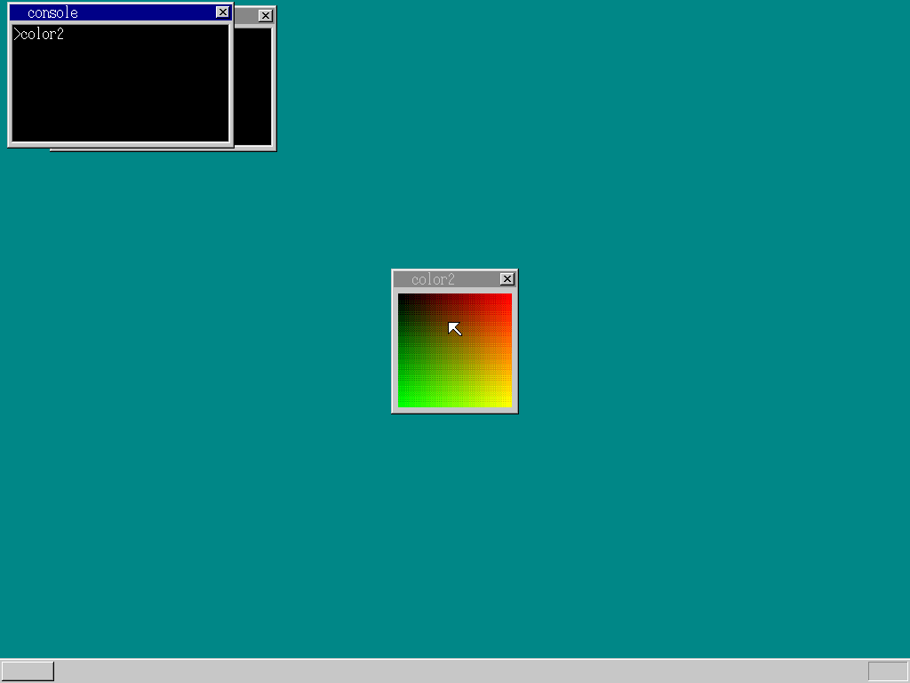
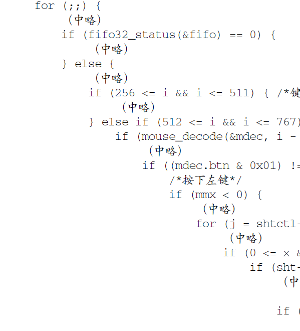
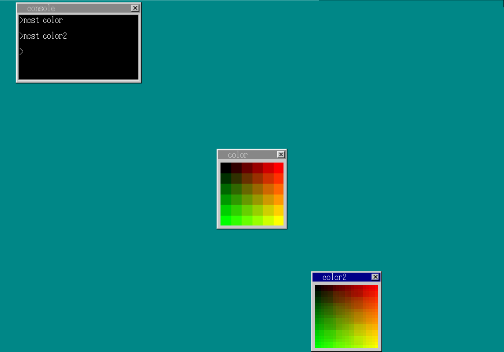

# day24-26

首先记录一个巨大的坑, 在某天装了ctex之后我的环境变量就莫名爆炸了, 结果make 命令找不到del和copy, 这个奇怪的bug在StackOverflow上根本无法找到解决方法, 只能到处调试,

最终, 在弄了两个小时之后发现了在30天自制操作系统的压缩包里面有三个可执行文件



将他们放到toolset之后可算能执行了, 可谓是windows环境变量的一大坑

# day24

### 窗口切换、移动窗口、关闭窗口和定时器切换

在切换时我们需要按照从上到下的顺序，判断鼠标的位置落在哪个图层的范围内，并且还需要确保该位置不是透明色区域。

当鼠标左键点击窗口时，如果点击位置位于窗口的标题栏区域，则进入“窗口移动模式”，使窗口的位置追随鼠标指针的移动，当放开鼠标左键时，退出“窗口移动模式”，返回通常模式。要实现窗口的移动，我们需要记录鼠标指针所移动的距离，为此我们添加了两个变量：mmx和mmy，mm是“move mode”，这两个变量所记录的是移动之前的坐标。由于鼠标指针不会跑到画面以外，因此我们规定当mmx为负数时代表当前不处于窗口移动模式。

判断是否点击了“×”按钮的方法，和之前窗口移动时判断是否点击到标题栏的方法是一样的。

我们已经显示出了3个以上的窗口，在按下Tab键时，我们需要判断切换到哪个窗口。我们规定按下Tab键时将键盘输入切换到当前输入窗口下面一层的窗口中，若当前窗口为最下层，则切换到最上层窗口。



### 定时器api

获取定时器（alloc）
EDX=16
EAX=定时器句柄（由操作系统返回）
设置定时器的发送数据（init）
EDX=17
EBX=定时器句柄
EAX=数据
定时器时间设定（set）
EDX=18
EBX=定时器句柄
EAX=时间
释放定时器（free）
EDX=19
EBX=定时器句柄

编写a_nask.nas

```asm
_api_alloctimer: ; int api_alloctimer(void);
MOV EDX,16
INT 0x40
RET
_api_inittimer: ; void api_inittimer(int timer, int data);
PUSH EBX
MOV EDX,17
MOV EBX,[ESP+ 8] ; timer
MOV EAX,[ESP+12] ; data
INT 0x40
POP EBX
RET
_api_settimer: ; void api_settimer(int timer, int time);
PUSH EBX
MOV EDX,18
MOV EBX,[ESP+ 8] ; timer
MOV EAX,[ESP+12] ; time
INT 0x40
POP EBX
RET
_api_freetimer: ; void api_freetimer(int timer);
PUSH EBX
MOV EDX,19
MOV EBX,[ESP+ 8] ; timer
INT 0x40
POP EBX
RET
```

当定时器超时时，会产生128这样一个值，这个值不是由键盘的编码所使用的，因此除了定时器，别的事件不可能产生这个值。如果产生的数据是128以外的值，那一定是用户按了回车键或者其他什么键，这时应用程序结束退出。

### 取消定时器

由于之前没有取消待机中的定时器, 所以关闭窗口后定时器会出现一个奇怪的字符, 我们现在要做的是关闭定时器, 下面是定时器的代码

```c
#define PIT_CTRL	0x0043
#define PIT_CNT0	0x0040

struct TIMERCTL timerctl;

#define TIMER_FLAGS_ALLOC 1 /* 已配置状态 */
#define TIMER_FLAGS_USING 2 /* 定时器运行中 */

int timer_cancel(struct TIMER *timer)
{
	int e;
	struct TIMER *t;
	e = io_load_eflags();
	io_cli(); /*在设置过程中禁止改变定时器状态*/
	if (timer->flags == TIMER_FLAGS_USING) { /*是否需要取消？*/
		if (timer == timerctl.t0) {
			/*第一个定时器的取消处理*/
			t = timer->next;
			timerctl.t0 = t;
			timerctl.next = t->timeout;
		} else {
			/*非第一个定时器的取消处理*/
			/*找到timer前一个定时器*/
			t = timerctl.t0;
			for (;;) {
				if (t->next == timer) {
					break;
				}
				t = t->next;
			}
			t->next = timer->next; 
			/*将之前“timer的下一个”指向“timer的下一个”*/
		}
		timer->flags = TIMER_FLAGS_ALLOC;
		io_store_eflags(e);
		return 1; /*取消处理成功*/
	}
	io_store_eflags(e);
	return 0; /*不需要取消处理*/
}

void timer_cancelall(struct FIFO32 *fifo)
{
	int e, i;
	struct TIMER *t;
	e = io_load_eflags();
	io_cli(); /*在设置过程中禁止改变定时器状态*/
	for (i = 0; i < MAX_TIMER; i++) {
		t = &timerctl.timers0[i];
		if (t->flags != 0 && t->flags2 != 0 && t->fifo == fifo) {
			timer_cancel(t);
			timer_free(t);
		}
	}
	io_store_eflags(e);
	return;
}

```



## day25

### 增加颜色

为了得到多种颜色, 我们可以将颜色交替排列.



```c
int api_openwin(char *buf, int xsiz, int ysiz, int col_inv, char *title);
void api_initmalloc(void);
char *api_malloc(int size);
void api_refreshwin(int win, int x0, int y0, int x1, int y1);
void api_linewin(int win, int x0, int y0, int x1, int y1, int col);
int api_getkey(int mode);
void api_end(void);

unsigned char rgb2pal(int r, int g, int b, int x, int y);

void HariMain(void)
{
	char *buf;
	int win, x, y;
	api_initmalloc();
	buf = api_malloc(144 * 164);
	win = api_openwin(buf, 144, 164, -1, "color2");
	for (y = 0; y < 128; y++) {
		for (x = 0; x < 128; x++) {
			buf[(x + 8) + (y + 28) * 144] = rgb2pal(x * 2, y * 2, 0, x, y);
		}
	}
	api_refreshwin(win, 8, 28, 136, 156);
	api_getkey(1); 
	api_end();
}

unsigned char rgb2pal(int r, int g, int b, int x, int y)
{
	static int table[4] = { 3, 1, 0, 2 };
	int i;
	x &= 1; 
	y &= 1;
	i = table[x + y * 2];	
	r = (r * 21) / 256;	
	g = (g * 21) / 256;
	b = (b * 21) / 256;
	r = (r + i) / 4;	
	g = (g + i) / 4;
	b = (b + i) / 4;
	return 16 + r + g * 6 + b * 36;
}
```



### 增加命令行窗口

在此时这个main函数已经非常巨大了, if语句甚至达到了12重, 按照Linus的设计风格的话三个if就要把作者吃了, 不明白作者为什么还要对其进行大规模且不降低圈复杂度的改动.



将命令行窗口的相关变量（buf_cons、sht_cons、task_cons和cons）各准备2个，分别分给命令行1和命令行2.

修改task结构体, 并将cons保存在task中

```c
struct TASK {
    int sel, flags; /* sel代表GDT编号*/
    int level, priority;
    struct FIFO32 fifo;
    struct TSS32 tss;
    struct CONSOLE *cons; /*从此开始*/
    int ds_base; /*到此结束*/
};
```

每个任务都拥有各自的TASK结构，我们将cons、ds_base保存在TASK结构中，由不同的任务读取出不同的值了。ds_base之前是从内存地址0x0fe8处读取的，而cons[0]的应用程序数据段地址和cons[1]的地址肯定是不同的，如果不在这里区分开的话，字符串的显示就会出问题。

由于我们为color.hrb准备的1003号代码段和1004号数据段，被color2.hrb所用的段给覆盖掉了。因此，当按下回车键唤醒color.hrb时，就会发生异常情况——明明应该去运行color.hrb的，结果却错误地运行了color2.hrb, 所以我们需要为其分配不同的段

## day26

### 窗口提速

sheet_refreshmap的速度太慢。这个函数在sheet_slide中被调用了两次，而每次调用需要进行上万次循环, 所以我们需要对齐进行精简, 我们可以将这个巨大的for循环分为两个部分:1. 有透明图层部分 2.无透明图层部分

其次, 如果我们用32位寄存器代替8位寄存器的话我们可以一次性向连续的4个字节中写入数据, 精简代码如下:

```c
if (sht->col_inv == -1) {
    if ((sht->vx0 & 3) == 0 && (bx0 & 3) == 0 && (bx1 & 3) == 0) {
        /* 无透明色图层专用的高速版（4字节型） */
        bx1 = (bx1 - bx0) / 4; /* MOV次数 */
        sid4 = sid | sid << 8 | sid << 16 | sid << 24;
        for (by = by0; by < by1; by++) {
            vy = sht->vy0 + by;
            vx = sht->vx0 + bx0;
            p = (int *) &map[vy * ctl->xsize + vx];
            for (bx = 0; bx < bx1; bx++) {
                p[bx] = sid4;
            }
        }
    } else {
        /* 无透明色图层专用的高速版（1字节型） */
        for (by = by0; by < by1; by++) {
            vy = sht->vy0 + by;
            for (bx = bx0; bx < bx1; bx++) {
                vx = sht->vx0 + bx;
                map[vy * ctl->xsize + vx] = sid;
            }
        }
    }
} else {
    /* 有透明色一般版 */
    for (by = by0; by < by1; by++) {
        vy = sht->vy0 + by;
        for (bx = bx0; bx < bx1; bx++) {
            vx = sht->vx0 + bx;
            if (buf[by * sht->bxsize + bx] != sht->col_inv) {
                map[vy * ctl->xsize + vx] = sid;
            }
        }
    }
}
```

为了发挥最好的效果, 我们需要使得每次窗口移动坐标也为4的倍数. 

同样, 刷新过程也可以变为4的倍数, 代码省略

伴随图层移动所进行的绘图操作非常消耗时间，导致系统来不及处理FIFO中的鼠标移动数据。我们可以等FIFO为空时再进行绘图操作:我们增加了new_mx和new_wy两个变量，并将原来的sheet_slide（sht_mouse, mx, my）;改成了new_mx = mx; new_my = my;我们并不真的移动鼠标图层的位置，而是将移动后的坐标暂且保存起来，当FIFO为空时，再执行sheet_slide（sht_mouse, new_mx, new_my）;

### 关闭命令行窗口

在关闭一个命令行窗口时首先需要将创建该窗口时所占用的内存空间全部释放出来，然后还需要释放窗口的图层和任务结构。在创建任务时我们为命令行窗口准备了专用的栈，却没有将这个栈的地址保存起来，这样的话就无法执行释放操作了, 所以我们需要在TASK结构中添加一个cons_stack成员，用来保存栈的地址。

bootpack.h

```c
struct TASK {
    int sel, flags; /* sel为GDT编号*/
    int level, priority;
    struct FIFO32 fifo;
    struct TSS32 tss;
    struct CONSOLE *cons;
    int ds_base, cons_stack; /*这里！*/
};
```

bootpack.c

```c
struct SHEET *open_console(struct SHTCTL *shtctl, unsigned int memtotal)
{
    （略）
    task->cons_stack = memman_alloc_4k(memman, 64 * 1024); /*从此开始*/
    task->tss.esp = task->cons_stack + 64 * 1024 - 12; /*到此结束*/
    （略）
}
void close_constask(struct TASK *task)
{
    struct MEMMAN *memman = (struct MEMMAN *) MEMMAN_ADDR;
    task_sleep(task);
    memman_free_4k(memman, task->cons_stack, 64 * 1024);
    memman_free_4k(memman, (int) task->fifo.buf, 128 * 4);
    task->flags = 0; /*用来替代task_free(task); */
    return;
}
void close_console(struct SHEET *sht)
{
    struct MEMMAN *memman = (struct MEMMAN *) MEMMAN_ADDR;
    struct TASK *task = sht->task;
    memman_free_4k(memman, (int) sht->buf, 256 * 165);
    sheet_free(sht);
    close_constask(task);
    return;
}
```

首先我们添加了一个结束命令行窗口任务的close_constask函数，关闭命令行窗口后还需要关闭图层，添加一个close_console函数，在关闭图层之后调用close_constask。在close_constask中，一开始我们先让任务进入休眠状态，这是为了将任务从等待切换列表中安全地剥离出来，因为这样一来就绝对不会切换到该任务，我们就可以安全地释放栈和FIFO缓冲区了。当全部内存空间都释放完毕之后，为了task_alloc下次能够重新利用这些内存空间，我们还需要将flags置为0。

接下来我们需要编写exit命令

```c
void cons_runcmd(char *cmdline, struct CONSOLE *cons, int *fat, int memtotal)
{
    （中略）
    } else if (strcmp(cmdline, "exit") == 0) {
        cmd_exit(cons, fat);
    } else if (cmdline[0] != 0) {
    （中略）
}
void cmd_exit(struct CONSOLE *cons, int *fat)
{
    struct MEMMAN *memman = (struct MEMMAN *) MEMMAN_ADDR;
    struct TASK *task = task_now();
    struct SHTCTL *shtctl = (struct SHTCTL *) *((int *) 0x0fe4);
    struct FIFO32 *fifo = (struct FIFO32 *) *((int *) 0x0fec);
    timer_cancel(cons->timer);
    memman_free_4k(memman, (int) fat, 4 * 2880);
    io_cli();
    fifo32_put(fifo, cons->sht - shtctl->sheets0 + 768); /* 768〜1023 */
    io_sti();
    for (;;) {
   	 	task_sleep(task);
	}
}
```

exit命令的执行部分中，首先我们需要取消控制光标闪烁的定时器，然后将FAT用的内存空间释放，最后调用close_console关闭命令行窗口和自身的任务
如果在cmd_exit中调用close_console的话，就相当于close_constask中的task_sleep对自己这个任务本身执行休眠，那么之后的程序就都无法继续执行下去了。因此，我们需要让task_a来替我们执行这个操作（注：虽然现在已经没有task_a这个窗口了，但是task_a这个任务依然存在，它负责处理鼠标指针的移动、将键盘输入的数据分配给各命令行窗口等工作）。那么我们可以从命令行窗口任务向task_a任务发送一个数据，请task_a帮忙关闭命令行窗口任务。task_a的FIFO地址保存在0x0fec这个地址（等一下我们会修改bootpack.c让它将地址写入这里），只要读取出来并发送数据就可以了。为了防止发送数据期间产生中断请求导致发送失败，我们将发送数据的程序两边加上cli和sti。发送完成之后，既然结束任务的处理已经交给task_a，那么命令行窗口任务本身也没有什么可做的了，接下来直接休眠就可以了。

### start命令

使用方法跟windows的start一样

```c
void cmd_start(struct CONSOLE *cons, char *cmdline, int memtotal)
{
    struct SHTCTL *shtctl = (struct SHTCTL *) *((int *) 0x0fe4);
    struct SHEET *sht = open_console(shtctl, memtotal);
    struct FIFO32 *fifo = &sht->task->fifo;
    int i;
    sheet_slide(sht, 32, 4);
    sheet_updown(sht, shtctl->top);
    /*将命令行输入的字符串逐字复制到新的命令行窗口中*/
    for (i = 6; cmdline[i] != 0; i++) {
  	  fifo32_put(fifo, cmdline[i] + 256);
    }
    fifo32_put(fifo, 10 + 256); /*回车键*/
    cons_newline(cons);
    return;
}
```

### ncst命令

当我们不想打开控制台的时候我们可以使用这个命令来打开窗口

```c
void cmd_ncst(struct CONSOLE *cons, char *cmdline, int memtotal)
{
    struct TASK *task = open_constask(0, memtotal);
    struct FIFO32 *fifo = &task->fifo;
    int i;
    /*将命令行输入的字符串逐字复制到新的命令行窗口中*/
    for (i = 5; cmdline[i] != 0; i++) {
    	fifo32_put(fifo, cmdline[i] + 256);
    }
    fifo32_put(fifo, 10 + 256); /*回车键*/
    cons_newline(cons);
    return;
}
```



